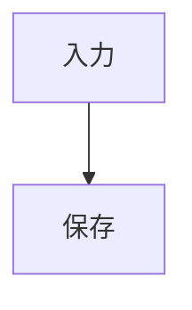

# ブログ用Tiptap文書プロファイル・Markdown変換・編集操作仕様書 v1.0

- 文書区分：文書データ仕様の正本
- 作成日：2026-09-23
- 仕様識別子：`blog-tiptap/1`
- 初期版：DBマイグレーション `0001`、記事 `format_version=1`、本文 `content_schema_version=1`。初回公開前の空DBを前提に版番号を統一する。
- 改訂内容：本文の正本をTiptap JSONへ変更し、各要素の許可範囲を正規化・変換の契約から定義
- 対象：記事メタデータ、制約付きTiptap JSON文書、Markdown変換、入力操作、表示、保存、他環境への出力
- 前提：既存記事は0件。旧構文との後方互換性は必須としない。
- 対象外：見積もり、実装済みとの認定

本書の「必須」「許可」「不採用」は、このブログが提供する完成時の動作を定める。現在のTiptap構成で、そのすべてが既に動くという意味ではない。ユーザーが指定した方針以外の細部は、本書で具体化した推奨の初期値である。

## 1. 採用基準

### 1.1 参照仕様と採用範囲

| 参照元 | 位置づけ | 本ブログでの採用 |
| --- | --- | --- |
| [TiptapのJSON・スキーマ](https://tiptap.dev/docs/editor/core-concepts/schema) | 編集・保存する文書形式 | 本文の正本。本書で許可するノード、マーク、属性、構造に限定 |
| [CommonMark 0.31.2](https://spec.commonmark.org/0.31.2/) | 公開された構文仕様 | 正規Markdown交換形式の基礎。本文H1、Setext、生HTML等には本書の制限を加える |
| [GFM 0.29-gfm](https://github.github.com/gfm/) | CommonMarkを拡張する正式な仕様 | 表、タスクリスト、打ち消し線、拡張自動リンクの4拡張を採用 |
| [Pandocの数式記法](https://pandoc.org/MANUAL.html#extension-tex_math_dollars) | Pandocの拡張文法の一次資料 | ドル記号による数式の境界規則を参照し、本書で入力範囲を限定 |
| [MyST](https://mystmd.org/spec) | 公開仕様と公式の拡張定義を持つ方言 | `note`、`warning`、`dropdown`、`figure`の限定した構文を採用 |
| [GitHubの記法ガイド](https://docs.github.com/en/get-started/writing-on-github/getting-started-with-writing-and-formatting-on-github/basic-writing-and-formatting-syntax) | GitHubサイトの機能・慣習 | alerts、数式、Mermaid、折り畳み等の出力先仕様として参照 |
| [Zennの記法ガイド](https://zenn.dev/zenn/articles/markdown-guide)、[Qiitaの記法ガイド](https://qiita.com/Qiita/items/c686397e4a0f4f11683d) | 各サイトの機能・慣習 | サイト別のエクスポート形式を定義するために参照 |
| 本書 | ブログ固有の仕様 | Tiptapの許可範囲、JSON正規化、Markdown変換、表示と編集操作の契約を定義 |

GFMの正式仕様と、GitHubサイトに追加された数式・alerts・Mermaid等は区別する。本ブログの本文は「Markdownへ再現可能に変換できる範囲に制約したTiptap文書」と定義する。交換形式はCommonMark/GFMを基礎にするが、CommonMark、GFM、MySTの完全準拠を表明しない。

### 1.2 保存・編集・変換の役割

| 層 | 規則 |
| --- | --- |
| 記事メタデータ | タイトル・サブタイトル・説明・タグは表示位置で直接編集する。説明は副題とタグ・日付の間に置く |
| 正本の本文 | 本書の文書プロファイルに適合するTiptap JSONを保存する |
| 編集中の状態 | 正本と未確定入力を区別し、一時空段落・未確定フォーム等も復旧可能にする |
| 正規Markdown交換形式 | Tiptap JSONから決定的に生成する。再取り込みで同じ正規文書を復元する |
| サイト別出力・表示 | Zenn、GitHub、Qiita向けMarkdownや表示HTML等を正本から生成する |

通常の編集・保存・再読込はTiptap JSONで行い、その途中にMarkdownへの変換と再解析を挟まない。MarkdownManagerはMarkdownの取り込み・出力の境界で利用する。生成したMarkdownやHTMLは派生データであり、本文の別の正本として同期編集しない。

Tiptap公式はJSONでの永続化を案内している。ただし、任意のJSONを許可するという意味ではなく、実際に登録した拡張のスキーマと本書の制約の両方に適合する必要がある。[Tiptap：Persistence](https://tiptap.dev/docs/editor/core-concepts/persistence)、[Schema](https://tiptap.dev/docs/editor/core-concepts/schema)

### 1.3 本書における「制約付きTiptap」

本文の正本は、Tiptapが扱う`type`・`attrs`・`content`・`marks`・`text`等を持つ文書JSONであり、別の独自ASTを正本にしない。利用中のTiptap拡張のJSON上の名前・属性へ、第5章の意味と制約を対応させる。

本書は実装のリポジトリ・拡張一覧を確認したものではない。独自の図・補足等の実際のノード名は断定しない。本文のスキーマ版ごとに、実装で登録する名前、属性、既定値と本書の対応を固定することを必須とする。`JSONContent`型に代入できることだけでは適合としない。

## 2. 記事とメタデータ

### 2.1 記事の構成

記事は「メタデータ」と「本文のTiptap JSON」を持つ。本文先頭の見出しや入力記号からメタデータを自動推定しない。

| 項目 | 型・必須性 | 意味・規則 |
| --- | --- | --- |
| `formatVersion` | 整数、必須。本改訂は`2` | メタデータを含む記事形式のバージョン |
| `bodyFormat` | `tiptap-json`、必須 | 本文の保存形式 |
| `contentSchemaVersion` | 整数、必須。現在は`1` | 許可するノード・マーク・属性・正規化規則の版。Tiptapのパッケージバージョンとは別 |
| `id` | 文字列、必須 | 記事を識別する不変のID。既存のサイトのID体系に合わせる |
| `title` | 文字列、公開時必須 | 記事タイトル。非公開では空文字を許可 |
| `subtitle` | 文字列またはnull | 任意のサブタイトル |
| `description` | 文字列またはnull | 一覧・検索・共有用の説明。サブタイトルとは独立 |
| `tags` | 文字列配列、既定`[]` | 前後の空白を除去し、完全一致の重複を除く。順序・大文字小文字・記号は保持 |
| `createdAt` | 日時、必須 | 記事を最初に作成した日時 |
| `updatedAt` | 日時、必須 | 本文または編集対象メタデータを最後に変更した日時 |
| `publishedAt` | 日時またはnull | 本ブログでの初回公開日時 |
| `status` | `draft`または`published` | 非公開または公開 |
| `body` | Tiptap JSONオブジェクト、必須 | `type: "doc"`を根とする本文。空文書も空文字ではなく所定の空docとして保存 |

`title`・`subtitle`・各タグは改行を含まないプレーンテキストとする。CRLF、CR、LF、Unicode行区切り（U+2028/U+2029）の連続は半角空白1個へ正規化する。既存値も読込時・保存時に同じ正規化を適用し、次回保存で永続化する。本文スキーマの変更ではないため版番号は維持する。タイトルの画面幅による自然な折返しは許可する。直接編集ではEnter/Shift+Enterによる改行を抑止し、貼付けもプレーンテキストとして正規化する。タグ欄は単一行とし、区切り入力はタグの確定に使用する。

`description`もプレーンテキストとする。直接編集の`#`、`*`等は文字として扱う。記事上部の副題の下で直接編集し、幅に応じて自然に折り返す。新たなEnter/Shift+Enterによる改行を抑止し、貼付けの改行は半角空白に変換する。既存値の改行は読込・未変更保存で保持する。本文とは独立した記事メタデータとして既存の保存経路を使う。

日時の表現は[RFC 3339](https://www.rfc-editor.org/rfc/rfc3339.html#section-5.6)に従い、正規保存はUTCの`Z`表記とする。作成・更新・公開という各日時の意味は、本ブログ独自の定義である。

- 通常の編集で`createdAt`を変更しない。
- 表示・プレビュー・エクスポート、意味を変えないJSON正規化だけでは`updatedAt`を更新しない。
- 公開を取り消して再公開しても、通常は初回の`publishedAt`を保持する。管理者は既存位置の日付入力で公開日を明示的に訂正できる。変更した日付（YYYY-MM-DD）はUTC 00:00:00として保存し、同じ日付の再送信では元の時刻を保持する。不正な日付は拒否する。
- 外部サービスの投稿ID、公開設定、投稿先固有のタグ制限等は、共通メタデータと別に管理する。
- メタデータの編集結果も保存対象とし、本文入力ルールとスラッシュメニューを適用しない。

### 2.2 タイトルと見出し

1. 記事ページのH1は1個とし、`title`を表示する。
2. 本文はH2〜H4を許可する。引用、リスト、補足、トグル内でもH1とH5・H6は禁止する。
3. H2〜H4は、それぞれ対応する見出しレベルで表示する。下位見出しをH2へ置換しない。
4. サブタイトルは通常のテキストとして表示し、本文の見出しに含めない。
5. タイトルが空の非公開記事でも、本文の最初の見出しをタイトルに移さない。
6. 目次UIは設けない。
7. H2からH4への飛びは内容を保持して注意表示できるが、自動修正しない。H2は「第◯節」を自動表示する明朝体の節見出し、H3・H4は番号を付けない左揃えの見出しとする。旧H3の中央見出しを廃止し、旧H4・H5をそれぞれH3・H4へ繰り上げる。旧JSON・Markdownの移行は行わない。

H1の個数は本ブログの製品仕様である。サブタイトルを見出しと分ける設計には、HTMLの[hgroupの説明](https://html.spec.whatwg.org/multipage/sections.html#the-hgroup-element)も参考にできる。

### 2.3 本文と記事ファイルを混同しない

本文では、ファイル先頭であっても単独の`---`をdividerとして扱う。YAML front matterを本文から自動検出しない。

記事全体の無損失バックアップには、メタデータ・スキーマ版・Tiptap JSONを含む記事JSONを使う。Markdownのファイル交換では、メタデータを別ファイルまたは明示した外枠へ出力する。Zenn向け等でfront matterを生成する場合、その区切りは記事ファイルの外枠であり、本文構文の例外ではない。本文Markdownだけでメタデータまで復元できるとは扱わない。

### 2.4 本文JSONの例

次は関係する項目だけを抜き出した保存例である。実際の記事では第2.1節の他の必須メタデータも含める。

~~~json
{
  "formatVersion": 2,
  "bodyFormat": "tiptap-json",
  "contentSchemaVersion": 1,
  "title": "記事タイトル",
  "body": {
    "type": "doc",
    "content": [
      {
        "type": "heading",
        "attrs": { "level": 2 },
        "content": [{ "type": "text", "text": "本文の見出し" }]
      },
      {
        "type": "paragraph",
        "content": [
          { "type": "text", "text": "A|B" },
          { "type": "hardBreak" },
          { "type": "text", "text": "# これは文字" }
        ]
      }
    ]
  }
}
~~~

JSONには見出しの`##`、改行の` `、Markdown用のエスケープを書き込まない。テキストの`#`や`|`は実際の文字として保存し、Markdown出力時に文脈に応じた表現へ変換する。

## 3. 本文要素の対応範囲

本章の「標準」「拡張」はMarkdownへの変換先の分類であり、Tiptapの組込み機能かどうかを表すものではない。許可するTiptapの属性・子要素は第5章、正規化と復元の条件は第9章で定める。下表の記号列をJSONへそのまま保存するのではなく、対応するノード・マーク・文字列として保存する。

| 要素 | 変換先の区分 | 正規Markdownへの変換 | Tiptap JSONで保持する意味 |
| --- | --- | --- | --- |
| 段落 | 標準 | 段落間を空行で分ける | 段落境界 |
| H2〜H4 | 標準＋範囲制限 | `##`〜`####` | 実際の見出しレベル |
| divider | 標準＋独自優先規則 | 前後を空行で分けた`---` | 区切り線であること |
| 引用 | 標準 | `>` | 引用の範囲・入れ子 |
| 箇条書き | 標準 | `-` | 項目、入れ子、段落構造 |
| 番号付きリスト | 標準 | `1.`等 | 開始番号、順序、入れ子 |
| タスクリスト | GFM拡張 | `- [ ]`／`- [x]` | 項目、チェック状態、入れ子 |
| コードブロック | 標準 | バッククォートフェンス | ソース、空白、言語指定 |
| 文字図 | 標準の用途 | 言語`text`のコードブロック | 空白・改行・等幅での表示 |
| インラインコード | 標準 | バッククォートで囲む | コード文字列 |
| 強調・太字 | 標準 | `*text*`／`**text**`を基本とする | 適用範囲・入れ子 |
| 打ち消し線 | GFM拡張 | `~~text~~` | 適用範囲 |
| リンク | 標準 | `[label](destination "title")` | 表示内容、URL、任意のtitle |
| 参照リンク | 標準の入力別表記 | 解決後、通常リンクへ正規化 | 表示内容、URL、title |
| 自動リンク | 標準＋GFM拡張 | 明示的な通常リンクへ正規化 | 表示文字列、URL |
| 画像 | 標準 | `` | src、alt、任意のtitle、挿入位置 |
| リンク付き画像 | 標準の組合せ | `` | 画像情報と外側のリンク情報 |
| 表 | GFM拡張＋制限 | 両端`\|`付きのpipe table | 行列、セル内容、列配置 |
| ソフト改行 | 標準 | 段落内LF | 段落を分けず、強制改行にしない |
| 強制改行 | 標準＋限定HTML | 通常段落途中は行末バックスラッシュ、他は` ` | 意図した行の区切り |
| エスケープ・文字参照 | 標準 | 必要なエスケープを施した文字 | 解釈後の文字。構文へ化けないこと |
| インライン数式 | 明示拡張 | `$TeX$` | TeX原文とインライン配置 |
| ブロック数式 | 明示拡張 | 独立行の`$$`で囲む | TeX原文とブロック配置 |
| INFO | MyST由来拡張 | `:::{note}` | INFOという種別、題名、本文 |
| WARN | MyST由来拡張 | `:::{warning}` | WARNという種別、題名、本文 |
| トグル | MyST由来拡張 | `:::{dropdown} 題名` | 題名、折り畳まれる本文 |
| 図 | MyST由来拡張 | `:::{figure} src` | 画像、alt、キャプションの関係 |
| Mermaid | サイト間で普及した拡張 | 言語`mermaid`のコードフェンス | Mermaid原文と図としての扱い |

### 3.1 初版で採用しないもの

- 本文H1、Setext見出し。
- 脚注、脚注番号の自動管理。
- 属性付きHTML、任意のHTMLブロック。許可する改行用` `は第4.5節で定義する。
- 表のセル結合、複数段のヘッダー、列幅指定、セル背景色、セル内ブロック。
- 下線、ハイライト、文字色、文字サイズ、フォント、本文の任意の中央寄せ。
- 図・数式の自動番号、参照ラベル、相互参照、複数画像の組図。
- INFO/WARN以外の補足種別。`TIP`等をWARNへ勝手に置換しない。
- 旧ブログ構文の`:::figure`、`:::mark-figure`、`:::details`、`> [!NOTE ...]`を正規Markdown交換構文として使うこと。

これらは、Tiptapで技術的に不可能という意味ではなく、本Tiptapプロファイルの対象外である。脚注はCommonMarkと正式GFMの標準要素ではないため、必要になった時点で明示的な拡張として追加する。

## 4. 正規Markdown交換文法と表示

本章はTiptap JSONとMarkdownの変換規則である。JSON中の通常文字にMarkdownのエスケープを持ち込まず、ノード属性にフェンスやHTML断片を保存しない。表示はJSONの意味から生成する。

### 4.1 見出し・divider

正規Markdown出力の見出しはATX形式のみとする。

~~~markdown
## 本文の最上位見出し

### 下位の見出し
~~~

通常本文の単独行`---`は、直前に空行がなくてもdividerとする。Setext見出しは両方の形式を不採用とし、`===`は文字列である。

~~~markdown
前の段落
---
次の段落
~~~

上の入力の正規Markdown出力は次のとおりとする。

~~~markdown
前の段落

---

次の段落
~~~

CommonMarkでは文脈により`---`がSetextの下線になるため、これは本ブログ固有の優先規則である。[CommonMark：Setext](https://spec.commonmark.org/0.31.2/#setext-headings)、[thematic breaks](https://spec.commonmark.org/0.31.2/#thematic-breaks)

- コード、TeX、Mermaid、文字図のソース内ではdividerに変換しない。
- 表のdelimiter行は構造上の`|`を含むものに限る。セル中の`---`は文字列。
- 引用・リスト内では、そのコンテナの構造とインデントを保ったままdividerを扱う。
- `***`、`___`等の通常のthematic break入力は受け入れ、Markdown出力は`---`へ統一する。
- 文字列としての`===`や`---`、入力変換を取り消した`#`等は、再読込・外部出力で別構文にならないようにエスケープする。

### 4.2 リスト

箇条書き、番号付きリスト、タスクリストの入れ子と混在を許可する。番号付きリストの開始番号を保持する。正規Markdownでは先頭だけ開始番号を使い、2項目目以降のマーカー数値は`1`に統一する。表示上の連番はリストの順序から決まる。

箇条書きは通常`-`でMarkdownへ出力するが、隣接する別リストの境界を保つために必要な場合は`*`または`+`を使う。番号付きリストも、独立した開始番号と境界を保持するため、必要に応じて`.`と`)`の区切りを使い分ける。同種の隣接リストを自動的に併合しない。

リストのtight/looseの区別と、1項目に含まれる複数段落を保持する。見た目を詰めるために必要な空行を取り除かない。リスト内のインデントは、親のマーカー幅と内容開始位置に合わせ、同じ構造へ再解析できるようにMarkdownへ出力する。[CommonMark：Lists](https://spec.commonmark.org/0.31.2/#lists)

タスクのチェックは編集画面で変更できる。公開ページのチェックボックスは状態の表示とし、閲覧操作で記事内容を変更しない。

### 4.3 コード・文字図・Mermaid

コードブロックはフェンス形式へ正規化する。インデント形式とチルダフェンスは読み込み時の別表記として受け入れる。ソース中にフェンス記号がある場合、それより長いフェンスを用いる。

- コードソースの空白、空行、タブ、末尾の空白を保持する。
- 言語指定は任意。未知の言語名でも原文を保持し、ハイライトできなくてもコードとして表示する。
- ファイル名、強調行等の追加属性は初版の本文仕様に含めない。追加info文字列を黙って切り捨てない。
- 文字図は`text`のコードブロックとし、等幅・空白保持で表示する。
- Mermaidは`mermaid`のフェンスとする。ソース編集と図のプレビューを提供する。
- Mermaidのソースをレンダリング済みSVGだけに置き換えて保存しない。
- Mermaidの描画に失敗しても、ソースを保持して診断を表示する。

~~~markdown

~~~

通常のMermaidフェンスはMySTでも公式に案内されている。[MyST：Diagrams](https://mystmd.org/guide/diagrams)

### 4.4 数式

インライン数式は`$...$`、ブロック数式は独立した行の`$$`で囲む。数式ノードはTeX原文を保持し、表示HTMLからTeXを復元しない。

~~~markdown
インライン数式は $E=mc^2$ と書く。

$$
\int_0^1 x^2\,dx = \frac{1}{3}
$$
~~~

初版の境界規則は次のとおりとする。

- インライン数式は1行とし、空の数式は正規本文に含めない。
- 開く`$`の直後と閉じる`$`の直前は空白にしない。
- インラインTeX原文にエスケープされていない`$`を含めない。また、原文末尾の連続バックスラッシュ数が奇数になる形を許可しない。区切りの早期終了や閉じドルのエスケープが起きるためである。該当入力は原文をWに保持し、TeXを勝手に書き換えて確定しない。
- 閉じる`$`の直後に数字が続く場合はインライン数式として認識しない。この判定は、数式外の文字参照を展開する前のソースに対して行う。
- 編集結果で数式の直後に数字がある場合、例えば数式`x`＋通常文字`2`は`$x$&#50;`としてMarkdownへ出力し、追加の空白なしで同じ表示と構造を復元する。境界確保のためにTeX原文を変更しない。この数値文字参照による正規形はブログ独自の規則である。
- 通常のドル記号はJSONでは文字`$`として持ち、Markdownでは`\$`へエスケープする。
- ブロック数式の区切りは各独立行に置く。TeX内の空行は初版では許可しない。
- コード内のドル記号は数式にしない。
- TeXのコマンド対応は区切り文法とは別に管理する。外部サイトで未対応のコマンドがある場合、ソースを改変せず出力診断の対象とする。

境界は[Pandocのtex_math_dollars](https://pandoc.org/MANUAL.html#extension-tex_math_dollars)を参照し、1行のインライン数式・独立行のブロック区切りを本ブログの制限として加えている。

数式はMathJax 4.1.3のTeX入力とSVG出力を用い、初期表示もサーバーで生成する。対応コマンドは同版に同梱されたTeX拡張の範囲とし、危険なURL・HTML属性はSafeHandlerで制限する。TeX原文の描画失敗は文書の情報を削除する理由にしない。[MathJax TeX拡張](https://docs.mathjax.org/en/latest/input/tex/extensions/index.html)。Mermaidは12.0.0の対応図種を利用し、securityLevel=strictで描画する。外部サイトの対応範囲を自ブログの図種制限にはしない。

### 4.5 表・表内改行・縦棒

表はGFMのpipe tableを基本とする。先頭行を見出しにしない場合だけ、ブログ内の`{table}`囲みで`:header: false`を指定する。

~~~markdown
| 項目 | 説明 | 値 |
| :--- | :---: | ---: |
| 改行 | 1行目 2行目 | 1 |
| 縦棒 | A\|B | 2 |
| コード | `A\|B` | 3 |
~~~

- 通常はヘッダー1行、delimiter1行、0行以上のデータ行とする。`:header: false`では先頭行もデータ行とし、delimiterは構文上の区切りとして保持する。
- すべての正規Markdown出力行に両端の`|`を付ける。1列表も同じ。
- すべての行を同じ列数とする。足りないセルは空セルとして補ってよい。
- 余分なセルがある入力は切り捨てず、原文を保持して要確認にする。
- 列配置は未指定、左、中央、右を区別する。操作対象は列全体。
- セル内容はインライン要素と強制改行に限定する。セル内でEnterを押しても段落を増やさず、強制改行にする。
- セル内の強制改行はJSONではhardBreakとして持ち、Markdownへ` `と出力し、再取り込みでhardBreakへ戻す。
- セル内の文字としての`|`は、再解析時に列区切りにならないようエスケープする。インラインコード内でも同じ。
- TeXに含まれる`|`や`\|`は、表のエスケープと数式の意味を分けて扱い、数式原文を再現できることを必須とする。機械的にすべて`\mid`等へ置換しない。
- セル内のソフト改行は許可しない。外部入力に存在する場合、空白との等価性を確認するか、変換の診断を出す。

GFMにはデータ行の余分なセルを無視する規則があるため、原文の保護は本書が加える要件である。コード中の縦棒にもエスケープを使う例は公式仕様にある。[GFM：Tables](https://github.github.com/gfm/#tables-extension-)、[example 200](https://github.github.com/gfm/#example-200)

改行として許可するHTMLは、属性のない` `、` `、` `のみ。大文字小文字の異なる同等のタグも読み込み時に受け入れ、正規Markdown出力は` `にする。コード・数式等のソース内、インラインコード内、またはエスケープされた`&lt;br&gt;`は文字である。

### 4.6 文字、改行、リンク、画像

- ソフト改行は同じ段落内の改行として保持し、表示上は通常の空白相当とする。強制的な行送りを行わない。
- 通常段落の途中で、同じブロック構造を再現できる強制改行は行末バックスラッシュ＋改行へ正規化する。見出し内、段落末、表セル内等では` `を使う。入力時の行末2空白や許可` `も受け入れる。ブロック末尾では行末バックスラッシュが強制改行にならないためである。[CommonMark：Hard line breaks](https://spec.commonmark.org/0.31.2/#hard-line-breaks)
- 行末2空白を単なる不要空白として削除してはならない。
- `&copy;`、`&#35;`等の有効な文字参照は文字へ展開し、JSONには展開後の文字を保存する。Markdownへ出力する際には、その文字が別構文にならないようにする。
- コード・TeX・Mermaid内の文字参照は各ソースの文字列として保持する。
- 解決できる参照リンク・自動リンクは通常リンクへ正規化する。参照ラベルの綴りや定義位置は保持対象外。
- 未使用の参照定義は編集用データになり得るため、存在を知らせず削除しない。原文保存または明示的な整理の対象とする。
- 通常画像は本文中の挿入位置を保持できるインライン要素として扱い、単独段落への配置も許可する。
- 画像のalt、画像title、リンク先、リンクtitleをそれぞれ独立に保持する。altをキャプションへ転用しない。
- `<https://example.com>`等の自動リンクは、生HTML制限の対象に含めない。

例：`&#35; 見出しではない`を解釈した後、行頭に`# 見出しではない`として無防備にMarkdownへ出力しない。必要なバックスラッシュで、文字列であることを維持する。[CommonMark：文字参照](https://spec.commonmark.org/0.31.2/#entity-and-numeric-character-references)

### 4.7 INFO・WARN・トグル

~~~markdown
:::{note} 補足
INFOとして表示する本文。
:::

:::{warning} 注意
WARNとして表示する本文。
:::

:::{dropdown} 詳細を見る
折り畳む本文。
:::
~~~

| 項目 | INFO / WARN | トグル |
| --- | --- | --- |
| Markdownのディレクティブ名 | `note` / `warning` | `dropdown` |
| UI上の名前 | INFO / WARN | トグル |
| タイトル | 任意、プレーンテキスト。未指定時はINFO / WARN | 必須、プレーンテキスト |
| 本文 | 1個以上の本文ブロック。編集中は空を許可 | 同左 |
| 初期状態 | 常時表示 | 閲覧開始時は閉じる |
| 保存しないもの | 色などの任意の見た目属性 | 閲覧者・編集者が一時的に開いた状態 |

タイトルは1行とし、Markdown記号は文字として扱う。JSONには復号済みのプレーンテキストを保存する。Markdown出力時にはCommonMarkのバックスラッシュエスケープ・文字参照を用い、読込時にはその1段だけを復号する。復号した文字列に再度Markdownの書式解析をしない。Markdown出力のためのバックスラッシュが表示タイトルに残らないようにする。本文の最初の見出し・太字段落をタイトルとして吸い上げない。

編集中はINFO/WARNのラベルまたは明示した題名をクリックすると、その補足の題名・種類を編集できる。本文は通常の本文と同様に、その場で直接編集する。既定ラベルのINFO/WARNは題名属性へ自動保存しない。

編集中のトグルは、表示されている題名の文字をその位置で1行のプレーンテキストとして直接編集する。開閉マーカーまたは題名以外のsummary領域をクリックすると本文を開閉する。開閉状態は文書データに保存しない。開いた本文もその場で直接編集できる。

段落、H2〜H4、リスト、引用、divider、コード、表、図、ブロック数式、Mermaid、別の補足・トグルを本文として許可する。入れ子は保存できるが、外部出力での制限は第11章に従う。

外側のコロンフェンスを内側より長くし、開始行と対応する終了行に同じ個数のコロンを使う。コード等のソース内にあるコロンフェンスをコンテナの終了と誤認しない。

MySTの[admonitions](https://mystmd.org/guide/admonitions)と[dropdowns](https://mystmd.org/guide/dropdowns-cards-and-tabs#dropdowns)を参照する。ただしタイトル自動抽出、任意の種類・属性、初期open等は採用しない。Sphinx版MySTとの完全な同一挙動も保証しない。

### 4.8 図

図は「画像＋alt＋キャプション」を1つの意味単位として保持する。

~~~markdown
:::{figure} /assets/diagram.png
:alt: 入力から出力までの処理を示す図

入力した本文が、解析・編集を経て保存される。
:::
~~~

- 画像ソースと`alt`を属性として持ち、キャプションを本文として持つ。初版のソースURLとaltは1行とする。図のソースURLは空白を含まないURI表記に限定する。空白を含む入力は、原値を保持して適切なURI表記への明示変換を求める。NやEがURLを勝手に符号化して別の文字列にしない。altは第4.7節のプレーンテキスト属性と同じエスケープ・復号規則で保持し、未指定と明示的な空文字を区別する。
- キャプションは単一段落のインラインMarkdown。複数ブロック、別の図の入れ子は許可しない。
- 初版の図は単一画像とし、幅、任意CSS、ラベル、自動番号、相互参照は持たない。
- altとキャプションの入力欄を分ける。空のaltを指定する場合も、未入力と区別して確認できるようにする。
- 初版のfigure構文は画像titleや画像リンク先の属性を定義しない。それらを持つ画像を図へ変換する際は、黙って属性を落とさず変換を止める。通常のリンク付き画像としては対応する。
- 文字図は`text`のコードブロック、Mermaidは`mermaid`のコードブロックとし、図と別の正規要素として扱う。

画像引数、alt、キャプションという構成は[MySTのfigure](https://mystmd.org/guide/figures)を参照する。本書はその限定した範囲を採用する。

## 5. 許可するTiptap文書プロファイル

### 5.1 許可範囲の決め方

本章は、UIに表示する機能だけでなく、正本として受け入れるTiptap JSONそのものを制限する。許可条件は次のすべてである。

1. 採用したTiptap拡張の文書スキーマに適合する。
2. 本章のノード、マーク、属性値、子要素と組み合わせに適合する。
3. 第9章の正規化・JSON再読込・正規Markdown往復の契約を満たす。

第3条件だけを理由に「変換できそうな任意のノード」を追加しない。許可範囲は以下の表で閉じ、それ以外は未対応として扱う。

Tiptapのスキーマは登録した拡張によって構成される。本書の列配置、図のcaption、数式原文等の意味制約は、スキーマに受理されることに加えて必要になるブログ独自の要件である。[Tiptap：Schema](https://tiptap.dev/docs/editor/core-concepts/schema)

### 5.2 子要素の集合

| 名称 | 内容 |
| --- | --- |
| 通常インライン | 文字、画像、インライン数式、hardBreak、softBreak |
| 限定インライン | 通常インラインから画像を除いたもの。図のキャプションに用いる |
| 本文ブロック | 段落、H2〜H4、引用、各リスト、divider、コード、Mermaid、表、ブロック数式、INFO/WARN、トグル、図 |
| リスト項目 | 先頭の段落と、それに続く0個以上の本文ブロック |
| 表セル内容 | 単一の段落。子は通常インラインからsoftBreakを除いたもの |
| ソース | コード・TeX・Mermaidとして扱う文字列。本文Markdownとして再解析しない |

構造用の行・セル・項目等は、それぞれの親の内部にだけ置く。doc直下にtableCellやlistItemを置かない。本文H1は、入れ子を含めてすべての位置で不採用とする。すべての文字値はUnicodeスカラー値の列とし、NUL（U+0000）と単独のサロゲートは正規本文の範囲外とする。文字の自動置換で受理せず、元入力を保持して診断する。

### 5.3 ブロック・コンテナ別の許可範囲

名称は意味を示す。実装で使用するノード名・属性名・既定値の正本は第13章に記載する。

| コンポーネント | JSONに保持する意味・属性 | 許可する子と値 | 正規Markdownへの変換・制約 |
| --- | --- | --- | --- |
| 文書（doc） | ブロックの順序 | 本文ブロック列。空文書は空のparagraph1個 | 空文書は空Markdownへ。他は順序を保持 |
| 段落（paragraph） | インライン内容 | 通常インライン | 段落間の空行。幅・文字寄せ等の属性は不採用 |
| 見出し（heading） | level | 整数2〜4、インライン内容。softBreakは不可 | 対応個数の`#`。hardBreakは` ` |
| divider（horizontalRule） | 区切りであること | 子なし、意味属性なし | `---`。記号の綴りはJSONへ保存しない |
| 引用（blockquote） | 引用範囲 | 1個以上の本文ブロック。編集途中の空はWで保持 | `>`。別々の引用の境界は勝手に併合しない |
| 箇条書き（bulletList） | 項目順、tight/loose | 1個以上の通常listItem | 基本`-`。隣接リストの境界を記号で保持 |
| 番号付き（orderedList） | 開始番号、項目順、tight/loose | 開始番号は整数0〜999999999。通常listItem | 先頭番号を保持。英字・ローマ数字表示等は不採用 |
| タスクリスト（taskList） | 項目順、tight/loose | 1個以上のtaskItem | `- [ ]`／`- [x]` |
| 通常項目／タスク項目 | 子ブロック。タスクはchecked | checkedは真偽値。先頭paragraph＋後続ブロック | 入れ子・複数段落を保持。checked属性のない通常項目との混在は同一リスト内では不可 |
| コード（codeBlock相当） | source、language | sourceは文字列。languageは未指定または空白・改行・フェンス記号を含まない1語 | フェンス。ソースの空白を保持。任意の見た目属性、ファイル名、強調行は不採用 |
| 文字図 | 上記コードのlanguage=text | 上記と同じ | 別の文書ノードを増やさない |
| Mermaid | コード相当のsource、予約language=mermaid、任意caption | ソース文字列。captionは一段落の文章。本文ブロックを内部に持たない | 無題は`mermaid`フェンス。有題は`{figure}`でフェンスとcaptionを囲むブログ限定の規則 |
| 表（table） | 行列、列ごとの配置、任意title | 先頭の見出し行は任意。データ行を含め1行以上、1列以上、全行同じ列数。titleは一行の文字列 | 見出し行のある無題表は矩形のpipe table。有題表と見出し行のない表は`{table}`で囲み、後者に`:header: false`を付ける。セル結合・列幅・背景色は不採用 |
| 表の行・セル | セル内容、ヘッダー区分 | 先頭行は全セルheaderまたは全セルdata、以降は全セルdata。セル内は単一段落 | colspan/rowspanは1、幅等は未指定。ヘッダー列や段階的ヘッダーは不採用 |

見出し行の任意化は既存のtableHeader/tableCellだけで表せるため、content_schema_versionは1のままとする。既存表は先頭行がtableHeaderのまま読み込み、保存時に自動変更しない。
| ブロック数式 | TeX原文 | 非空文字列。独立した`$$`行、空行をソース内部に持たない | `$$`ブロック。画像化した結果だけの保存は不可 |
| INFO/WARN | 種別note/warning、任意題名 | 題名は1行のプレーンテキストまたは未指定、本文ブロック列 | 対応directive。本文から題名を推定しない |
| トグル | 題名、本文 | 題名は空でない1行、本文ブロック列 | dropdown。初期状態は閉じる。open属性による記事固有の指定は不採用 |
| 図 | 単一画像のsrc・alt、caption | srcは非空、altは明示文字列、captionは単一paragraphの限定インライン | MyST figure。caption後のlegend、画像リンク・画像title・複数画像・寸法は不採用 |

- リストの種類の混在は、入れ子または別リストとして許可する。同一リスト内に通常項目とタスク項目が混在する外部入力は、無断で分割せず診断する。
- tight/looseはJSONから復元できる値として保持する。各項目が単一段落の場合でも、複数項目間の空行由来の区別を失わない。複数段落を持つリストにtightを指定しない。
- 1項目だけで、その項目の有効な子ブロックも1個だけのリストではlooseを許可しない。空行を挿入して区別を符号化する場所がないためである。有効な子ブロックには構造用の空paragraphを数えない。該当する外部JSONのlooseをtightへ丸めず診断する。[CommonMark：Example 322](https://spec.commonmark.org/0.31.2/#example-322)
- 表の配置は未指定・左・中央・右。実装上セル属性に保存する場合も、同じ列の値を一致させる。異なるセル配置を多数決等で丸めない。
- 通常コードの言語`mermaid`と、独立したMermaidノードを、正規JSONに重複した表現として許可しない。既存実装が専用ノードを持つ場合、スキーマの対応付け・移行で正規表現を1つに固定する。
- ブログの正規Markdownでは`math`というコード言語を数式へ自動変換しない。GitHub/Qiita形式の`math`フェンスを数式として読むのは、その外部形式を選んだ取り込みに限定する。
- コード化して掲載するMermaidはlanguageをtextに変え、sourceを保持する。
- 空のコードブロックは許可する。空の数式、題名のないトグル、画像未選択の図は、未確定入力Wとして保持する。

### 5.4 インライン・マーク別の許可範囲

| コンポーネント | 許可する値・属性 | JSON上の意味 | 変換時の制約 |
| --- | --- | --- | --- |
| 文字（text） | 非空でCR/LFを含まないUnicode文字列 | 解釈後の実際の文字。文字参照やMarkdownエスケープそのものではない | CR/LFを含む通常textの入力は、取り込み時の明示変換で改行要素へ分けるかWに保持。Nで暗黙変換しない |
| 太字・強調・打ち消し線 | 属性なし | 該当範囲のマーク | 対応するMarkdownのマークへ |
| インラインコード（code mark） | 非空で改行を含まない文字範囲 | コードとしての文字列 | 空白とバッククォートを保持できる区切り・パディングを使う |
| リンク（link mark） | 非空で1行のhref、任意の1行title | 対象インラインとリンク情報 | 表示内容とURLを保持。入れ子リンク・同一区間の複数hrefは不可 |
| 画像（image） | 非空src、明示alt文字列、任意の1行title | インライン位置の画像 | altとtitleを区別。リンク付き画像は外側linkも保持 |
| インライン数式 | 非空の1行TeX、先頭末尾に空白なし。未エスケープのドルと末尾奇数バックスラッシュは不可 | TeX原文とインライン配置 | ドル境界を考慮する。必要なら数式外の後続文字を文字参照で出力 |
| hardBreak | 意味属性なし | 同じブロック内の強制改行 | 通常段落途中は行末バックスラッシュ等、見出し・表・末尾は` ` |
| softBreak | 意味属性なし | 強制改行しないソース上の改行 | 通常段落・caption内の内部位置のみ。先頭末尾、連続break、見出し、表セルでは不採用 |

- 通常画像と図のsrc・altは1行。altは空文字を明示指定できるが、未設定を空文字へ黙って変えない。
- 空のlink範囲は文書要素として保存しない。画像だけを内容に持つリンクは許可する。
- インラインコードの先頭末尾の空白は削らない。空白だけでも非空であればコードとして保持できる。インライン数式の境界空白は仕様外であり、TeXをtrimして受理しない。
- softBreakの前後には、文字・画像・インライン数式等の内容を持たせる。空行や段落境界をsoftBreakに置き換えない。
- ターゲット、rel、HTML class、style等は本文の著者指定属性にしない。必要なサイト側のリンク表示方針は表示層で決める。

### 5.4.1 意味と表示を分ける文字書式

既存のbold=strong（重要）、italic=em（傍点）、strike=sの保存上の意味は維持する。contentSchemaVersion=1の後方互換なマーク追加として、b（太字）、i（イタリック）、underline（下線）、highlight（mark）、subscript（sub）、superscript（sup）を許可する。既存記事を再解釈・破棄しない。subscriptとsuperscriptは排他的とする。dfn、cite、var、ins、del、smallは対応しない。

対話入力とMarkdown取り込みは異なる。対話入力は `**文字**`→bold、`*文字*`→b、`_文字_`→i、`__文字__`→underline、`==文字==`→highlight。囲み記法（重要・太字・イタリック・下線・ハイライト・打ち消し）は行頭、空白の直後、または非ASCII文字（漢字・かな・全角英数・全角句読点等）の直後で発火する。ASCIIの非空白文字直後は従来どおり発火しない。直前の文字は保持する。単一の囲みは二重の囲みの途中で発火しない。code内とIME変換中は発火しない。emには囲み入力を設けない。

Markdownの既存構文 `**` / `__` はbold、`*` / `_` はitalicのまま。新マークの正規Markdownは属性なしの対になる `<b>`、`<i>`、`<u>`、`<mark>`、``、`` で表し、限定されたインライン構文として読み込む。任意属性・未知タグ・不正な閉じ方は拒否し原文を保持する。通常の貼り付けは従来どおり文字である。

対話入力の境界条件とは独立に、正規Markdownおよび外部向けMarkdownで強調・重要・打ち消し線（`*`、`**`、`~~`）の連続マーク範囲に隣接する内容があり、その境界が空白でない場合は囲みの外側へ半角スペースを1個補う。例：`日本語 **重要** です`。行頭・行末への空白追加や既存空白の重複はしない。HTMLタグとして出す書式やコードには独自の空白を補わない。JSONと入力時の発火条件は変更しない。この補助空白は出力上の意図的な例外で、再取り込みでは通常の本文空白として扱われるため、当該箇所は文字列の厳密な往復一致の対象外とする。

strongは濃赤 #701c28 とfont-weight:700、bは通常色のfont-weight:700、iはfont-style:oblique 10deg（CJK共通の標準角度ではなく、Adobeの日本語向け斜体加工例の10°を参考にした本文用の控えめな指定。専用Italic/Oblique書体が利用できる場合はその字形を使い、追加の10°変形は掛けない。専用書体がない文字のみfont-synthesis:styleで10°の合成を許可し、要素のtransformは使わない。現行Chromiumと本文フォント構成では英字の専用Italicと日本語の10°合成を描画比較で確認する。CSSの照合はブラウザに依存するため、フォントや対応ブラウザを変える場合もこの優先関係を検証する）、underlineは下線、emは現在の傍点、markは現在の背景マーカー。リンクは #8c4037 と下線を維持し、重要と区別する。sub/supは文字を小さくして上下へ配置するが行高は増やさない。

| コマンド | 表示 | 保存マーク | キー |
| --- | --- | --- | --- |
| /strong | 重要 | bold | Mod+Alt+S |
| /bold | 太字 | b | Mod+B |
| /italic | イタリック | i | Mod+I |
| /underline | 下線 | underline | Mod+U |
| /em | 強調（傍点） | italic | なし |
| /mark | ハイライト | highlight | Mod+Shift+H |
| /sub | 下付き | subscript | なし（スラッシュ／選択保持パレットのみ） |
| /sup | 上付き | superscript | なし（スラッシュ／選択保持パレットのみ） |

外部向けはGitHub/Qiitaで追加マークを限定HTMLとして出力する（u/markの表示はサービスのHTML制限に依存するため診断）。Zennではbをstrong、iをemへ変換し、他の追加マークは文字内容を保持して書式を落とし、意味・書式の損失を診断する。本文JSONは変更しない。

書式解除は追加マークも解除し、リンクは保持する。スラッシュ補完のキャレット位置・選択保持・Undo・Enter/Tab確定の挙動は維持する。

### 5.5 マークと要素の組み合わせ

| 対象 | 許可するマーク | 許可しない組み合わせ |
| --- | --- | --- |
| 通常文字 | bold、italic、b、i、underline、highlight、subscript、superscript、strike、link、code。sub/sup以外の併用を許可 | 複数の異なるlink、未知マーク |
| 画像 | linkだけ | 装飾マーク、code |
| インライン数式 | なし | link、装飾マーク、code |
| hardBreak | bold、italic、b、i、underline、highlight、subscript、superscript、strike、link | code |
| softBreak | 前後に続く同一の許可された非codeマークの範囲内に限る | code、softBreakだけへの単独マーク |
| ブロック要素 | なし | ブロック全体へのインラインマーク |

マークは段落・見出し等のブロック境界を越えない。インラインコードは改行を含めず、複数行への適用は元の改行を残して各行へ適用する。画像や数式を含む選択への書式操作は、対象外の要素を削除したり型を変えたりせず、許可された文字範囲だけを対象にすることを明示する。

Tiptap既定のcode markには他のマークを排除する設定がある。本プロファイルのcode＋link等を許可するには、それを表せるスキーマと変換契約が必要であり、既定設定の保証として扱わない。[Tiptap：Schemaのexcludes](https://tiptap.dev/docs/editor/core-concepts/schema#excludes)

Markdownでは、空白だけの装飾範囲や境界の記号を、そのまま囲うとマークとして解釈されない場合がある。正規Markdown出力は必要な文字参照等を使い、文字と適用範囲を変えずに再現する。これを理由にJSON内の文字やマーク範囲をtrimしない。

### 5.6 空段落と編集状態

正規本文では、空段落の個数を余白の指定に使わない。段落間の余白は表示層で決める。

- 空のdocを表すparagraph、空の表セル、リスト項目等でスキーマが要求する空のparagraphは、構造上の既定値として許可する。
- Enter直後の入力場所、末尾の入力補助段落、複合要素内の未入力欄等は編集状態Wに保持し、保存・再開で復旧する。
- 通常の本文の間に一時的に空段落が複数あっても、編集中にその入力状態を勝手に消さない。
- 一時空段落を正規本文から分離する規則は編集状態として明示し、既存JSON中の未知の空要素をまとめて削除する一般的な正規化にはしない。

### 5.7 正本に含めない情報

| 情報 | 扱い |
| --- | --- |
| 選択範囲、フォーカス、パレット検索、未確定フォーム | 編集状態W。W内の文書スナップショットもTiptap JSONとし、Markdownへ退避して復元しない |
| トグルの一時的開閉 | 閲覧・編集のUI状態 |
| 数式HTML、MermaidのSVG、ハイライトHTML、レイアウト寸法 | 正本から生成する派生情報 |
| 診断、レンダリングキャッシュ、アップロード進捗 | 正本とは別に持つ処理状態 |
| 記事ID・日時・タグ | 記事メタデータ |
| 自動生成するDOMアンカー・編集用ノードID | 本文の意味属性にしない。必要な編集用識別情報は別に管理 |

Tiptapの拡張が文書JSONへ追加するid等は、自然に比較対象外になるわけではない。本プロファイルでは著者指定のブロックID・相互参照を初版で採用しない。既存のidにリンク等の意味がある場合、無意味な値と見なして除去せず、未対応データとして保持する。

### 5.8 公式機能と本プロファイルの関係

通常要素、表、画像、リンク、タスク、数式、Details等は対応する公式拡張を土台にできる。図・補足の意味属性、softBreak、tight/looseの保持、Markdownの往復契約は採用構成で明示的に満たす必要がある。

公式Markdown機能は確認時点でBetaであり、`gfm: true`は本プロファイルの保証にはならない。MarkdownManagerは入出力の変換を担当する。[Tiptap：Markdown](https://tiptap.dev/docs/editor/markdown)、[MarkdownManager](https://tiptap.dev/docs/editor/markdown/api/markdown-manager)、[Table](https://tiptap.dev/docs/editor/extensions/nodes/table)、[Mathematics](https://tiptap.dev/docs/editor/extensions/nodes/mathematics)

## 6. Markdown風入力ルールとキー操作

### 6.1 用語と共通規則

「Markdown風キーバインド」は、`# `、`**text**`等を入力すると文書要素へ変わる入力ルールを指す。`Ctrl+B`等のキー組合せは、別に「キー操作」と呼ぶ。

以下は本ブログの保証する入力操作であり、Tiptapの既定値の一覧ではない。Tiptapの入力ルールは拡張できる。[Tiptap：Input Rules](https://tiptap.dev/docs/editor/api/input-rules)

1. ブロック用の入力ルールは、通常段落の先頭で記号列を入力したときに発火する。リスト等の中でも、その位置に該当ブロックを入れられる場合は利用できる。
2. 表セル内ではブロック用入力ルールを発火させない。
3. コード、Mermaid、TeXのソース編集領域内では、通常のMarkdown風変換を行わない。
4. IME変換中は発火せず、確定後に判定する。
5. エスケープされた記号は入力ルールの対象外とする。
6. 変換1回をUndo1回で戻せる。取り消した記号をJSONの文字として保持し、Markdown往復でも書式に変わらないようにする。
7. 未完成の文字列を勝手に削除しない。
8. 本文の読み込み、Markdownとして貼り付ける操作、ファイル入力には対話入力ルールを適用しない。
9. 通常の文字貼り付けは文字列として扱う。Markdownを構造として貼り付ける操作は明示的に選ぶ。特に見出しレベルを誤ってずらさない。
10. コンテナの開始行を入力して作成した後は、閉じフェンスの手入力を要求しない。通常の本文編集を行う。JSONにはコンテナ構造を保存し、Markdown出力時にフェンスを生成する。

### 6.2 見出しの入力・Tiptap保存・Markdown出力の対応

| 対話入力（行頭＋Space） | 作成・JSON保存する要素 | 正規Markdown出力 | スラッシュの表示 |
| --- | --- | --- | --- |
| `# ` | H2 | `## 見出し` | 見出し H2 |
| `## ` | H3 | `### 見出し` | 見出し H3 |
| `### ` | H4 | `#### 見出し` | 見出し H4 |
| `#### `以上 | 変換しない | 文字として残すなら必要なエスケープを付ける | H5以上は提供しない |

JSON再読込では保持した見出しレベルをそのまま復元する。Markdownの`##`を取り込んだ場合もH2であり、H3へずらさない。Markdown本文`#`はH1であり、本プロファイルの本文範囲外として扱う。

Tiptap標準のHeading入力は`#`→H1であり、レベル範囲の設定だけでは本表の変換にならない。本表はブログ独自の入力仕様である。[Tiptap：Heading](https://tiptap.dev/docs/editor/extensions/nodes/heading)

### 6.3 その他の入力ルール

表中の「Space」「Enter」は確定に使うキーである。直接変換する操作では開始用の記号を表示本文から取り除く。属性フォームが必要な操作では、フォーム確定時に入力を要素へ置換し、キャンセル時には元の文字列と選択位置を保つ。

| 要素 | 対話入力 | 結果 |
| --- | --- | --- |
| 箇条書き | `-`、`*`、`+`＋Space | 箇条書きの最初の項目 |
| 番号付きリスト | `1.`等の数字＋`.`＋Space | 指定した開始番号のリスト |
| タスクリスト | `[ ]`または`[x]`＋Space | 未完了／完了のタスク |
| 引用 | `>`＋Space | 引用内の段落 |
| divider | `---`＋Enter | 区切り線と後続の入力位置 |
| コードブロック | バッククォート3個＋任意の言語名＋Enter | コードのソース編集を開始 |
| 文字図 | バッククォート3個＋`text`＋Enter | 言語textのコード編集 |
| Mermaid | バッククォート3個＋`mermaid`＋Enter | Mermaidのソース編集とプレビュー |
| 重要 | `**text**` | bold（strong）へ |
| 太字 | `*text*` | bへ |
| イタリック | `_text_` | iへ |
| 下線 | `__text__` | underlineへ |
| ハイライト | `==text==` | highlightへ |
| 打ち消し線 | `~~text~~` | 完結した範囲を打ち消しへ |
| インラインコード | バッククォートで囲んだ文字 | コード文字列へ |
| リンク | `[label](url)` | 完結した範囲をリンクへ |
| URLから画像 | `` | 画像へ |
| リンク付き画像 | `` | 外側まで完結した全体をリンク付き画像へ |
| インライン数式 | `$TeX$`＋Space | 境界条件を満たす数式へ。Spaceは後続の通常文字として残す |
| ブロック数式 | `$$`＋Enter | ブロック数式のソース編集 |
| INFO | `:::{note}`＋任意の「Space＋題名」＋Enter | INFOの本文編集 |
| WARN | `:::{warning}`＋任意の「Space＋題名」＋Enter | WARNの本文編集 |
| トグル | `:::{dropdown} 題名`＋Enter | 題名付きトグルの本文編集 |
| 図 | `:::{figure} URL`＋Enter | 図の作成フォーム。alt・キャプションを設定 |
| 表 | 短い入力ルールは設けない | ツールバーかスラッシュから作成 |
| 強制改行 | 行末バックスラッシュ＋Enter、または行末2空白＋Enter | 同一段落内の強制改行 |

コード開始の「バッククォート3個」は、その後に言語を指定しない場合も使える。数式・Mermaid等の専用ルールを、通常コード・本文ルールによって別要素へ変換しない。

- `- `による箇条書きへの変換後、その項目の先頭で`[ ] `／`[x] `を入力した場合もタスクへ切り替える。これにより`- [ ] `の連続入力を扱える。
- 太字・強調のアンダースコア表記も、採用文法で同じ意味になる範囲で受け入れる。
- リンク・画像の入力では、エスケープ、URL内の括弧、任意title等を含む完全な構文を正しく扱う。単純な部分一致でURLを切らない。
- リンク付き画像では、外側のリンクが未完の間に内側だけを確定して情報を落とさない。
- 数式のSpace確定は、閉じるドルの後の数字との競合を避けるための入力上の規則。ソース文法自体に数式後のSpaceを要求するものではない。
- `:::{dropdown}`だけのように必須属性がない場合は属性フォームを開けるが、キャンセル時には元の入力を残す。
- 完全なGFM表をMarkdownとして取り込めることと、短い記号による表作成は別機能とする。

### 6.4 基本キー操作

`Mod`はmacOSではCommand、Windows/LinuxではCtrlを指す。本表は本ブログのキー割り当て契約とし、利用する拡張の既定値との差は調整対象とする。

| キー | 操作 |
| --- | --- |
| Enter | 通常は新しい段落。リスト内は次の項目、見出し末尾は段落 |
| Shift+Enter | 強制改行。表セル内も同じ |
| Alt+Enter | 通常段落内のソフト改行。見出し・表セル・ソース内では利用不可 |
| Tab / Shift+Tab | リスト項目の入れ子を深く／浅くする。表内では次／前のセルへ |
| Mod+B | 選択文字または次の入力の太字を切り替える |
| Mod+I | イタリック（i）を切り替える |
| Mod+Alt+S | 重要（strong）を切り替える |
| Mod+U | 下線を切り替える |
| Mod+Shift+H | ハイライトを切り替える |
| Mod+E | インラインコードを切り替える |
| Mod+Shift+X | 打ち消し線を切り替える |
| Mod+K | 選択文字・画像へのリンク作成、またはリンク編集 |
| Mod+/ | 選択を保持してコマンドパレットを開く |
| Mod+Enter | 最も内側のコード、数式、Mermaid、引用、補足、トグル1つの直後へ移動する |
| Mod+Z | Undo |
| Mod+Shift+Z | Redo |
| Escape | パレット・未確定フォームを閉じる。既存本文を変更しない |

- キー処理はソース編集領域、表セル、リスト項目、通常本文の順に優先する。ソース内のTabはインデント入力に用い、親リストを操作しない。Mod+B/I/E/K等の本文書式操作も親本文へ伝播させない。
- ソース編集領域ではEnterをソースの改行として扱う。Alt+Enter等の本文書式操作を混入させない。
- Mod+Enterまたは退出コマンドでは、カーソルを含む対象要素のうち最も内側の1つだけから出る。フォームの未確定ソースも保持してから移動し、未保存入力を捨てない。
- 1つのインラインコードへソフト改行・強制改行を内包させない。複数行の選択に適用する場合は改行を残して行ごとに適用する。コード書式が有効な状態で改行する場合、改行前でコード範囲を終了する。CommonMarkのコードスパンではソース改行が空白へ変わるため、別途保持が必要である。[CommonMark：Code spans](https://spec.commonmark.org/0.31.2/#code-spans)
- 表セルのEnterは強制改行とする。最終セルからTabで進む場合は必要に応じて新しいデータ行を追加する。
- リストの空項目でEnterを押した場合は、1段外へ出る。内容のある項目を自動削除しない。
- インライン数式等が選択中の場合、Mod+Enterはその要素の後へカーソルを移す。
- ブラウザーやOSがキーを受け取れない環境でも、同じ操作へパレット・属性UIから到達できるようにする。

Tiptapの代表的なキー操作は[公式のキーボードショートカット資料](https://tiptap.dev/docs/editor/core-concepts/keyboard-shortcuts)にある。選択保持、ソフト改行、コンテナ退出を含む本表全体は、ブログの仕様である。

## 7. ツールバー仕様

### 7.1 掲載基準

Markdownの全文を書けば表現できる、というだけでは「Markdown風入力に対応」と数えない。第6章で定義した短い入力操作によって、その場で編集可能な要素を作れるかで判定する。

**固定の本文ツールバーは、Undo・Redoと以下の3項目のアイコンボタンとする。**

| 固定アイテム | 機能 | 掲載理由 |
| --- | --- | --- |
| 表を挿入 | 列数・データ行数を指定し、ヘッダー1行付きの表を作る。初期値は2列・データ2行 | 初版には短い表作成入力を設けないため |
| 画像をアップロード | ローカル画像を選択し、本文内でキャプションを編集できる図として配置する | ファイル選択・アップロードはMarkdown文字入力では行えないため |

| リンクを挿入 | 文章とURLのポップアップ。選択範囲があればその文章へ適用する | 選択中の文章へ直接リンクを付けるため |

表の行数入力には「データ行数」と表示し、ヘッダーを数に含むか曖昧にしない。表はボタンに接する非モーダルの小さなポップアップで「列数 × データ行数」を横並びに入力する。画像ボタンは直接ファイル選択を開き、本文への画像ファイルの直接ドロップにも対応する。アップロード後は空のキャプションを持つ図を挿入し、キャプションは本文で直接編集する。図への切り替えチェックボックスやアップロードフォームは設けない。各挿入フォームに「未確定のまま下書き保存」操作は設けない。

固定ツールバーに、太字、見出し選択、リスト、URL画像、引用、divider、コード、数式、INFO/WARN、トグル、図、Mermaidの作成ボタンを重複配置しない。これらは第6章の入力と第8章のパレットで作成できる。

タイトル等の記事設定、保存、プレビュー、Undo/Redo、コマンドメニューを開く操作は記事編集全体の操作であり、本文要素の作成アイテムと分ける。タッチ操作等のため、同じパレットを開く「コマンド」ボタンを提供してよい。

### 7.2 選択対象の編集UI

既存の属性を変更する操作には、Markdown風入力だけでは対応できないものがある。以下は対象を選択したときだけ、文脈ツールバー・ポップオーバー・ノード内フォームに表示する。

| 選択対象 | 許可する操作 |
| --- | --- |
| リンク | URL・任意titleの変更、リンク解除 |
| 画像 | src・alt・任意title・外側リンクの編集、ファイルの差し替え |
| 図 | 画像の差し替え、alt、キャプションの編集、通常画像とキャプション段落への分解 |
| 表 | 行列の追加・削除、列配置、表全体の削除 |
| 番号付きリスト | 開始番号 |
| リスト | tight/loose、同じ項目への段落追加 |
| コード | 言語変更、ソース編集 |
| 数式 | TeX編集。インライン／ブロック変換は配置上可能な場合のみ |
| Mermaid | ソース編集、プレビュー、言語をtextへ変えて原文を残すコード化 |
| INFO / WARN | 種類・題名の編集、明示された題名と本文を残した解除。未指定時の既定ラベルは段落化しない |
| トグル | 題名の編集、題名・本文を残した解除 |

対象のないときには、これらを空の常設ボタンとして並べない。マークの適用・解除はModキー操作と選択保持パレットで行う。図の幅、表のセル結合、文字色等、保存仕様にない属性は表示しない。

TiptapのTableが持つ操作の範囲と、ブログがUIへ公開する操作の範囲は異なる。またImage本体にはアップロード処理は含まれない。[Tiptap：Table](https://tiptap.dev/docs/editor/extensions/nodes/table)、[Image](https://tiptap.dev/docs/editor/extensions/nodes/image)

## 8. スラッシュコマンドと正規化されたアクセス

### 8.1 基本契約

スラッシュメニューは、**本書で許可した全種類の本文要素の作成・適用へ到達する統一入口**とする。記号の別表記を重複したアイテムとして並べず、同じ意味の要素を同じ項目に集約する。

各項目は、一意なコマンド名、日本語表示名、分類、検索用別名、入力ヒント、実行条件を持つ。名前・検索語はUIだけの情報であり、本文JSONにもMarkdown出力にも含めない。

### 8.2 起動・検索・選択保持

| 操作・状態 | 必須動作 |
| --- | --- |
| 通常段落の先頭・空白直後・日本語や全角文字の直後で`/`を入力 | その位置を挿入対象としてパレットを開く |
| 文字や画像を選択してMod+/ | 選択を失わず、同じパレットを開く |
| 日本語名・英語名・別名を入力 | 同じ正規項目を検索する。別名ごとに重複行を出さない |
| 上下キー / Ctrl+n・Ctrl+p | 下／上へ項目選択を移動する。未選択から下は先頭、上は末尾を選ぶ |
| Enter / Tab | 選択済みの候補を確定する。必要なら属性フォームへ進む。未選択なら確定せず候補を閉じ、通常の改行／フォーカス移動を行う |
| Escape | 候補を閉じる。本文を変更しない |
| 初期表示・検索文字列の変更 | 複数候補は未選択。候補が1件だけなら自動選択する。IME変換中のキーは候補操作として扱わない |
| 実行できない位置 | 文脈に適合する項目のみを候補に表示する |
| コード・TeX・Mermaidソース内の通常の`/` | 文字として入力する。自動起動しない |
| 同ソース内のMod+/ | パレットは開けるが、文脈に合わない本文操作は候補から除く |

- `https://`や半角英数字の語・パスの途中の`/`ではメニューを発動しない。日本語・全角文字に隣接している場合は、後続文字の有無にかかわらず起動する。
- `/`で開いた場合、すべての項目で選択した時点にコマンド検索文字列を取り除く。属性フォームやファイル選択へ進む前に本文へ反映する。項目選択前のEscapeは入力文字列を残す。項目選択後のフォームのキャンセルでは文字列を復活させず、Undoで削除を取り消せる。即時実行する操作は文字列の削除と同じUndo単位にする。
- 候補には日本語名と薄い英語コマンド名（`/table`等）を併記し、メニュー幅を広げない。
- 検索文字列は記事内容として自動保存しない。パレット表示中も、それ以前の本文と編集中の未確定入力を保持する。
- パレットを開いた直前の選択を操作対象とする。属性フォームを開いた後に選択が移っても、別の場所へ適用しない。
- タイトル・タグ等のフォームでは本文パレットを自動起動しない。

### 8.3 作成・適用カタログ

`/heading-2`等の表記は、検索・起動用の正規名であり、Tiptapの保存表現やMarkdownの構文ではない。

| 分類 | 正規コマンド | 表示名 | 主な検索用別名 | 動作 |
| --- | --- | --- | --- | --- |
| 本文 | `/paragraph` | 段落 | text、本文、p | 現在の見出しを段落にする、または段落を挿入 |
| 本文 | `/heading-2` | 見出し H2 | h2、見出し2 | H2を設定 |
| 本文 | `/heading-3` | 見出し H3 | h3、見出し3 | H3を設定 |
| 本文 | `/heading-4` | 見出し H4 | h4、見出し4 | H4を設定 |
| 本文 | `/blockquote` | 引用 | quote、引用文 | 段落・選択ブロックを引用で包む |
| 本文 | `/divider` | 区切り線 | hr、separator、divider | dividerを挿入 |
| リスト | `/bullet-list` | 箇条書き | ul、bullet、リスト | 箇条書きにする |
| リスト | `/ordered-list` | 番号付きリスト | ol、number、番号 | 開始番号を指定できるリスト |
| リスト | `/task-list` | タスクリスト | todo、checkbox、チェック | タスクリストにする |
| 書式 | `/strong`、`/bold`、`/italic`、`/underline`、`/em`、`/mark`、`/sub`、`/sup` | 5.4.1の表示名 | 同節の意味名 | 選択または次の入力へ適用・解除 |
| 書式 | `/strike` | 打ち消し線 | strikethrough、削除線 | 同上 |
| 書式 | `/inline-code` | インラインコード | code-inline、コード文字 | 同上。文字列をコードとして扱う |
| 書式 | `/link` | リンク | url、reference-link、autolink | 文字・画像へリンク設定。既存リンクなら編集 |
| 書式 | `/hard-break` | 強制改行 | br、改行、hardbreak | 強制改行を挿入 |
| 書式 | `/soft-break` | ソフト改行 | softbreak、ソース改行 | 通常段落内のソフト改行。見出し・表内・ソース内は無効 |
| 書式 | `/literal-text` | 文字として挿入 | escape、entity、記号 | 入力をMarkdownとして解析せず文字として挿入 |
| コード・数式 | `/code-block` | コードブロック | code、fence、コード | 言語とソースを設定 |
| コード・数式 | `/math-inline` | インライン数式 | inline-math、文中数式 | 選択したTeXまたは入力フォームから挿入 |
| コード・数式 | `/math-block` | ブロック数式 | display-math、数式ブロック | ブロック数式を作成 |
| コード・数式 | `/mermaid` | Mermaid | diagram、フロー図 | Mermaidソース編集とプレビュー |
| 補足・構造 | `/note` | INFO・補足 | info、note、補足 | INFOを作成、または既存補足をINFOへ |
| 補足・構造 | `/warning` | WARN・警告 | warn、warning、注意 | WARNを作成、または既存補足をWARNへ |
| 補足・構造 | `/dropdown` | トグル | details、toggle、折り畳み | 題名付きトグルを作成 |
| 画像・表 | `/image` | URLから画像 | img、画像、linked-image | URL・alt等を設定。外側リンクも指定可能 |
| 画像・表 | `/upload-image` | 画像をアップロード | upload、画像選択 | 固定ツールバーと同じアップロード |
| 画像・表 | `/figure` | 図 | caption、キャプション | 画像・alt・キャプションを設定 |
| 画像・表 | `/table` | 表 | grid、table、テーブル | 列数・データ行数を指定して作成 |

「文字図」「text-diagram」で検索した場合は、`/code-block`の言語`text`プリセットへ到達させる。別の保存要素や重複コマンドは増やさない。

`/h1`を本文の第1階層という別名にしない。H1はタイトル専用である。脚注や任意HTML等の不採用要素を、挿入可能な項目として表示しない。

### 8.4 属性編集・解除・構造操作

以下の操作も同じパレットから到達できる。表配置の左・中央・右等の値は、下位選択肢にまとめてよい。

| 正規コマンド | 対象と動作 |
| --- | --- |
| `/edit-element` | 選択したリンク・画像・図・数式・コード・Mermaid・補足・トグルの属性編集。edit-image等はこの項目の文脈付き別名 |
| `/unlink` | 表示文字・画像を残して、リンクだけを解除 |
| `/clear-inline-formatting` | 太字・強調・打ち消し線・インラインコードだけを解除。リンク・数式・画像は残す |
| `/unwrap` | 引用・補足・トグルを解除し、本文を同じ順序で残す。明示した題名があれば段落として残す |
| `/exit-block` | 現在のコード・コンテナ等の後続段落へ移動。要素は削除しない |
| `/indent` / `/outdent` | リスト項目の階層を1段変更 |
| `/list-start` | 番号付きリストの開始番号を変更 |
| `/list-spacing` | tight/looseを変更。複数段落がある項目を潰してtightにはしない |
| `/list-paragraph` | 同じリスト項目に新しい段落を追加 |
| `/task-check` / `/task-uncheck` | チェック状態を明示的に設定 |
| `/code-language` | コードの言語指定を変更 |
| `/figure-to-image` | 図を通常画像とキャプション段落へ分解 |
| `/math-convert` | 数式のインライン／ブロックを変換。配置上不可能なときは無効 |
| `/mermaid-to-code` | Mermaid原文を言語textのコードとして残し、図描画の扱いを解除 |
| `/table-row-before` / `/table-row-after` | 選択セルの行の前／後にデータ行を追加 |
| `/table-column-before` / `/table-column-after` | 列を追加 |
| `/table-delete-row` / `/table-delete-column` | 選択行／列を削除 |
| `/table-align` | 選択した列の配置を未指定／左／中央／右へ設定 |
| `/table-delete` | 表全体を削除 |
| `/delete-element` | 選択した要素を削除。対象範囲を表示し、Undo可能にする |

表の先頭行の操作メニューには、その行を見出しにするかどうかのチェック欄を設ける。切替時はセルの本文と配置を保ち、tableHeaderとtableCellの種類だけを切り替える。見出し行の前に追加する「データ行」は、見出し行の直後に挿入する。見出し行だけの削除は許可しない。最終列の削除は表全体削除と同じ結果になることを明示する。

複数セルの列配置は、それらのセルが属する列全体へ適用する。セル単位の配置にしない。

### 8.5 適用範囲と解除の規則

- 太字等は選択全体にその書式がある場合は解除し、混在している場合は全体へ適用する。選択なしでは次の入力の書式を切り替える。
- `/paragraph`は現在の見出し・通常段落の種類だけを変更する。内部のリンクや太字をまとめて消さない。
- 複数ブロックを1つの見出しやインライン要素へ潰す操作を自動で行わない。
- ブロック挿入は空段落を置換するか、現在のブロックの後に挿入する。文中にカーソルがある場合も、元の本文を無断で分割・削除しない。
- ブロック範囲が選択されている場合、引用・リスト・補足・トグルは選択を包める。表・図等の挿入で選択内容を上書きしない。
- 表セル内のトグル、ブロック数式、表、図、見出し等は無効とし、「表セル内にはこのブロックを挿入できません」と表示する。
- 書式付き文字からコード等への意図的な変換では、その操作で失う書式を区別する。文字やURLを予告なく落とす包括変換にしない。
- ダイアログのキャンセルは無変更。確定1回はUndo1回で戻せる。
- タイトル等への移動を追加する場合は「記事設定へ移動」とし、本文へタイトルやタグを挿入しない。

### 8.6 構文の別表記とメニューの対応

| 入力構文・状態 | 正規化したアクセス先 |
| --- | --- |
| ATXのH2〜H4 | 対応する`/heading-2`〜`/heading-4` |
| 外部形式として取り込んだSetext | 移植元文法で解釈後、適合する見出しへ変換。本文直接入力ではSetext不採用 |
| 対話入力 `**` / `*` / `_` / `__` / `==` | 順に `/strong` / `/bold` / `/italic` / `/underline` / `/mark` |
| インデント・バッククォート・チルダのコード | `/code-block` |
| `text`の文字図 | `/code-block`のtextプリセット |
| 通常リンク・参照リンク・自動リンク | `/link` |
| 通常画像・参照画像 | `/image` |
| リンク付き画像 | `/image`のリンク属性、または画像選択後の`/link` |
| エスケープ・文字参照 | 通常の文字。記号を書きたい場合は`/literal-text` |
| 行末2空白・行末バックスラッシュ・許可` ` | `/hard-break` |
| 空行を含むリスト | 各リスト＋`/list-spacing`・`/list-paragraph` |
| リストの入れ子 | 各リスト＋`/indent`・`/outdent` |
| INFO / note、WARN / warning | それぞれ`/note`、`/warning` |
| toggle / details / dropdown | `/dropdown` |
| 表の配置指定 | `/table-align` |

### 8.7 Tiptapとの関係

現在のTiptap公式には、Start plan対象の[Slash Dropdown Menu](https://tiptap.dev/docs/ui-components/components/slash-dropdown-menu)があり、項目と分類を追加できる。一方、[旧Slash Commands実験例](https://tiptap.dev/docs/examples/experiments/slash-commands)は未サポート・未保守とされている。

本書のコマンド体系、選択保持、無効理由の表示はブログ独自の動作契約とする。特定の既製UIや料金プランの採用を、本文形式の条件にはしない。

## 9. JSON正規化・再読込・変換の保証

### 9.1 用語と比較範囲

| 記号・名称 | 定義 |
| --- | --- |
| D | 本文のTiptap JSON。メタデータ、編集状態、キャッシュを含めない |
| P | 第5章の許可範囲に適合する本文の集合 |
| W | 未確定の文字・属性・一時空段落等を含む編集途中の状態 |
| S(D) | 本文が持つ意味。文字、順序、種類、属性、書式範囲、構造の境界 |
| N | 意味を変えないTiptap JSONの正規化 |
| E | 正規Tiptap JSONから正規Markdown交換形式への変換 |
| I | 正規Markdown交換形式からTiptap JSONへの変換 |
| Eₜ | 特定サイトtの形式への出力 |

N、E、Iはスキーマ版・変換仕様版に結び付ける。環境、乱数、現在時刻、ネットワーク応答で結果を変えない。外部画像の配置変更等はサイト別出力の明示した変換として扱う。

### 9.2 正規JSONで同一視する差

Nが扱ってよい差は、次の一覧に限定する。

| 差 | 正規化 |
| --- | --- |
| JSONオブジェクトのキー順 | 比較上同一。ファイル化する場合のキー順は固定できる |
| 同じマーク・同じ属性を持つ隣接textの分割 | 1つのtextへ連結 |
| マーク配列の順序 | スキーマ版に定めた順序へ統一 |
| 属性も同じマークの重複 | 1つへ統一 |
| 既知の既定属性の省略と明示 | スキーマ版に列挙した既定値へ統一 |
| 既知の任意配列の省略と空配列 | 当該ノード定義で同値としたものだけ統一 |

代表的な既定値は、orderedListの開始番号1、表配置の未指定、結合なしのspan=1、通常コードの言語未指定、任意題名未指定等。alt未入力と明示空文字は同値にしない。異なるhrefを持つ重複linkは正規化対象ではなく不適合とする。

実装が必要とする既定属性は、既存の拡張JSONに合わせてスキーマ版の対応表へ明示する。未知の属性を「既定値だろう」と推測して削除しない。

### 9.3 保持する意味

S(D)には少なくとも次を含める。

- 文字列とインライン要素の順序、書式の適用範囲。
- 見出しレベル、段落、引用、リスト、各コンテナの境界。
- リスト開始番号、項目順、checked、tight/loose、複数段落。
- リンクhref・title、画像src・alt・title、リンク付き画像の外側リンク。
- 表の行列数、セル内容、列配置、ヘッダー区分、改行、縦棒。
- コード・TeX・Mermaid原文。通常文向けのtrimや文字参照展開を適用しない。
- INFO/WARNの種別と題名、トグルの題名と本文。
- 図の画像情報とキャプションの関係。
- softBreakとhardBreakの区別。

意味が等しい文字列の推測によるURL書換え、TeXの整理、Unicode正規化、全角半角変換はNに含めない。原文のCRLFをLFへ変更する場合も、変換方針として明示してから受け入れる。正規本文のソースはLFを用い、受入済みの文字列に保存のたびに加工を加えない。

同じhref・titleが連続するlink markは、Tiptapの1つの連続マーク範囲として扱う。この範囲にある内部textノードの分割は意味としない。一方、異なるリンク情報や間に非リンク内容がある境界は保持する。

### 9.4 正規化の契約

適合する本文について、次を満たす。

~~~text
S(N(D)) = S(D)
N(N(D)) = N(D)
~~~

Nは任意のJSONを強制的にPへ丸める関数ではない。未知ノード、未知マーク、未知属性、不許可の子構造、意味を変える属性値は定義域外として診断する。原JSONを保護したまま、明示的な変換または修正を行う。

ノード名の変更や意味のある属性構造の変更は、通常のNとは別のスキーマ移行で扱う。本文へ乱数IDを付け直す操作もNに含めない。

### 9.5 通常の保存・再読込

通常保存はN(D)のTiptap JSONを保存する。再読込は同じスキーマ版でJSONから文書を復元する。

~~~text
N(JSON再読込(JSON保存(N(D)))) = N(D)
~~~

この経路でMarkdown変換を挟まない。JSONを保存できたことと、Markdownへ変換できたことは別の評価項目とする。

### 9.6 正規Markdownとの往復

Pに含まれる正規本文について、次を必須とする。

~~~text
N(I(E(N(D)))) = N(D)
E(N(I(E(N(D))))) = E(N(D))
~~~

前者は「Markdownを経由して同じ正規Tiptap文書を復元できること」、後者は「再度出力しても正規Markdownが安定すること」を表す。比較はJSONのキー順等を除いた構造値で行い、未知属性の除去で式を成立させない。

この式のDは本文だけである。記事全体の復元には、メタデータとスキーマ版を含む記事JSONのバックアップを使う。

変換で保証するのは元のMarkdownの綴りではなく、受け入れたTiptap文書の意味である。参照リンク・自動リンクの綴り、マーカーの種類等は正規形式へ変換できる。ただし未使用参照定義等の本文外の入力情報は、第10章の原文保持に回す。

### 9.7 組み合わせと境界の変換条件

- 表セル内の文字`|`はJSONでは実際の文字として持ち、Eだけが必要なエスケープを行う。インラインコードやTeXとの組み合わせでもI後の原文が一致する。
- hardBreakはJSONに` `という文字列を保存しない。Eが位置に応じた表現を選び、IがhardBreakへ戻す。
- 数式の直後が数字であっても、JSONへ余計な空白を挿入しない。Eは第4章の境界表現を使う。
- 隣接する別々のリストは、`-`／`*`、`.`／`)`等を使い分けて境界を保持する。開始番号の違いをNで消さない。
- 隣接する別々の引用は、その引用のマーカーを付けない空行で区切る。入れ子では親コンテナの引用マーカーやリストのインデントは保持する。同じ引用内の段落区切りには引用マーカーを持つ空行を使い、両者を区別する。外部JSONの引用を無断で併合しない。[CommonMark：Example 242](https://spec.commonmark.org/0.31.2/#example-242)
- 連続する画像だけの段落をfigureへ自動変換したり、段落をcaptionとして推測したりしない。
- コード・ブロック数式・Mermaidでは、フェンスとソースを分ける構造上の改行をソース文字列へ混入させない。正規交換形式では開始フェンス後のLFと終了フェンス前のLFを各1個の区切りとして扱い、その間の追加LFはソースの内容として保持する。Markdownの一般的なコードトークンを、そのまま無条件にソース属性へ代入する保証はしない。
- 文字のエスケープはE、復号はIで行う。JSONの通常textにMarkdown用のバックスラッシュを事前に付けない。

### 9.8 外部サイトへの変換

Eₜはサイト別に定める。正規Markdownの往復式を、すべてのサイト形式へ一律に要求しない。

| 結果 | 意味 |
| --- | --- |
| 同等の要素として出力 | 対応する構造・内容を出力できる |
| 内容を保つ表現変更 | 図→画像＋caption段落、入れ子alert→通常引用等。構造の復元は保証しない |
| 描画結果への変換 | Mermaid等を画像へ。元ソースは正本に残すが、出力先では同じ編集性を持たない |
| 未対応 | 原本を変えず、その要素の出力を診断する |

サイト別出力はDを変更しない。外部の機能不足を理由に正本のキャプション、数式、表等を削除しない。対応形式・変換の診断は第11章に従う。

## 10. 編集途中・不適合JSON・取り込み

### 10.1 正規本文の保存と編集中の状態

正規本文Dと、未確定入力を含む編集状態Wを区別する。保存するのは適合する本文JSONのみとする。未確定フォームは適用またはキャンセルするまで編集中のメモリーに保持し、保存・完了時に案内を表示する。未確定状態を別の下書きとして保存する操作やフォールバックは設けない。

| 状態 | 扱い |
| --- | --- |
| Pに適合する本文 | JSONで通常保存・再読込する |
| 記号入力中・一時空段落・未確定フォーム | 編集中はWに保持する。未確定フォームは適用またはキャンセルしてから保存する |
| 空数式・未選択画像等 | 確定したコンポーネントと区別し、Wに残す |
| 未対応のノード・属性・スキーマ版 | 元JSONと診断を保持し、理解できた部分だけで上書きしない |
| 適合JSONだが変換処理が失敗 | JSON保存は維持する。失敗したエクスポートだけを止め、実装の変換不適合として扱う |
| TeX・Mermaidの描画失敗 | ソースを保存し、描画診断を出す。文書スキーマ違反と区別 |
| 外部サイトの制限 | 正本を保持し、そのサイト向け出力の表現変更・未対応を表示する |

初版の許可範囲は変換可能性を踏まえて閉じているが、エクスポーターの障害が入力データの喪失につながってはならない。ブログ自身が正しく表示できる適合本文の公開は、外部サイトの機能不足だけを理由に妨げない。未確定要素や自ブログでも表示できない内容は、公開前に修正または表示方法を確定する。

### 10.2 不適合JSONの扱い

スキーマ検証と本プロファイルの検証は、初期ロード、外部JSONの取り込み、貼り付け、コマンド、保存など、本文を生成・変更する境界に共通して適用する。UIからボタンを消すだけでは制約を満たさない。

- Tiptapに渡す前の入力JSONを保持する。
- 未知のtype、marks、attrsを黙って捨てない。
- 新しいスキーマ版の文書を古い拡張構成で開き、残った部分を正本へ保存しない。
- 修正が必要な場合は、該当箇所と理由を示し、明示変換・原文として保持・削除等を選べるようにする。
- 意味のある属性を落とす変更は、通常の正規化ではなく内容変更またはスキーマ移行として扱う。

Tiptapの公式資料も、スキーマ不一致により内容が除かれる問題と、適合確認の仕組みを説明している。ただしスキーマ検証だけでは本書の変換保証までは確認できない。[Tiptap：Invalid schema](https://tiptap.dev/docs/guides/invalid-schema)、[Schemaの検証](https://tiptap.dev/docs/editor/core-concepts/schema#invalid-schema-handling)

### 10.3 Markdown等を取り込む場合

| 入力モード | 解析規則 |
| --- | --- |
| Tiptap JSONの通常再読込 | contentSchemaVersionに対応した文書スキーマとプロファイルで読む |
| 記事JSONの取り込み | メタデータ・スキーマ版・本文を取り込む |
| 通常の文字貼り付け | textとして挿入し、Markdown構文として解釈しない |
| 正規Markdownとして取り込み | 第4章のブログ文法をIでTiptapへ変換する |
| 外部CommonMark / GFM / Zenn / Qiita | 指定した移植元文法で解析し、本プロファイルへ変換する |
| HTML等のリッチテキスト貼り付け | 許可要素への変換と診断を行う。HTMLの再描画をJSON保存と同等とは扱わない |

Markdownでの`---`はdivider、Setextなし、front matterなしというブログの入力規則を維持する。外部Setextは移植元の文法で先に解釈する。本文H1をタイトルへ移すのは、外部取り込みの明示変換に限る。

### 10.4 原Markdown・HTMLの保持

- 未対応ディレクティブ、未知属性、未使用参照定義、列数超過の表等を黙って省略しない。
- 影響範囲や参照関係を安全に分離できなければ、文書全体の元入力を保持する。
- 変換結果がPに適合しない間は、元の入力と診断をW等の復旧対象に残す。未対応情報を持つ任意のopaqueノードを、可逆変換保証のある正規本文へ混ぜない。
- 元入力の綴りを残したい場合は、正本とは別の取り込み原文として保存できる。それをJSONと双方向同期する別の正本にはしない。
- 文字として取り込む場合は、JSONのtextまたはcodeに実際の文字を保持する。後のEが必要なエスケープを行う。
- すべての未知記法を自動検出できるとは保証しない。

許可する改行用` `および5.4.1の限定インライン記法以外の生HTMLは、HTML要素として本文へ保存しない。HTMLブロックと判定した範囲は原文を保持し、その一部だけをMarkdownとして再解釈しない。文字・コードとして残す変換は明示的に行う。

CommonMark自体では任意の文字列が文書になるため、取り込み時の診断は「本ブログのプロファイル範囲外」「この変換では情報を保持できない」と説明する。[CommonMark：文書の定義](https://spec.commonmark.org/0.31.2/#characters-and-lines)

## 11. エクスポートと移植性

### 11.1 方針

本プロファイルのTiptap JSONを正本とし、Zenn、GitHub通常Markdown、Qiitaへ別々に出力できるようにする。対象サイトへの投稿・公開は、ファイル出力とは別の操作である。

| 要素 | Zenn向け | GitHub通常Markdown向け | Qiita向け |
| --- | --- | --- | --- |
| タイトル | 記事メタデータ | 本文先頭に`# タイトル`を生成 | 記事メタデータ |
| サブタイトル | 導入の通常段落へ | H1直下の通常段落へ | 導入の通常段落へ |
| 本文H2〜H4 | そのまま | そのまま | そのまま |
| コード | 言語付きフェンス | 同左 | 同左 |
| インライン数式 | ドル形式 | 数式用のドル＋バッククォート形式を優先 | 数式用のドル＋バッククォート形式を優先 |
| ブロック数式 | 独立行の`$$` | `math`フェンスを優先 | `math`フェンスを優先 |
| INFO | `:::message` | `> [!NOTE]` | `:::note info` |
| WARN | `:::message alert` | `> [!WARNING]` | `:::note warn` |
| トグル | `:::details 題名` | `
`と`
` | `
`と`
` |
| 図 | 通常画像＋キャプション | 通常画像＋キャプション段落 | 通常画像＋キャプション段落 |
| 文字図 | `text`フェンス | 同左 | 同左 |
| Mermaid | `mermaid`フェンス | 同左 | 同左 |
| 表 | pipe table | pipe table | pipe table |
| 表内改行 | ` `を候補とする | ` `を候補とする | ` `を候補とする |
| 表内の縦棒 | 適切なエスケープ | `\|` | `\|` |
| タグ | topicsへ変換 | 記事情報として別途表記可能 | tagsへ変換 |

対応構文の一次資料：[Zennガイド](https://zenn.dev/zenn/articles/markdown-guide)、[GitHubの数式](https://docs.github.com/en/get-started/writing-on-github/working-with-advanced-formatting/writing-mathematical-expressions)、[GitHubの折り畳み](https://docs.github.com/en/get-started/writing-on-github/working-with-advanced-formatting/organizing-information-with-collapsed-sections)、[GitHubのalerts](https://docs.github.com/en/get-started/writing-on-github/getting-started-with-writing-and-formatting-on-github/basic-writing-and-formatting-syntax#alerts)、[Qiitaガイド](https://qiita.com/Qiita/items/c686397e4a0f4f11683d)

この表の「優先」「導入段落」「画像＋キャプション」等は、本ブログの出力方針である。サイト側に同じメタデータや図の構造が存在するという意味ではない。

- 外部向けのインライン数式はJSONの数式ノードを直接変換する。同じ文字列を含む通常文字・コード・リンク先を検索置換しない。表セルでは変換後も縦棒のエスケープを維持する。
- 外部向けの表題は表の直前の通常段落へ分離する。ヘッダーなし表は空のヘッダー行を追加し、元の全行をデータ行として残す。列の配置を保持し、この構造変換を診断する。
- 外部向けのMermaidキャプションはフェンス直後の通常段落へ分離する。表題・キャプション中のMarkdown記号は文字としてエスケープする。
- 上記変換はリスト・引用・補足・トグル内でも適用し、ブログ独自の表・図ディレクティブを外部向け出力へ残さない。正本JSONと正規Markdownの形式は変更しない。

### 11.2 移植時に保持できないもの

- GitHubのalertsは他要素への入れ子に制限がある。トグル内のINFO/WARN等は、題名・種別を明記した通常引用等へ変換する。[GitHub：alerts](https://docs.github.com/en/get-started/writing-on-github/getting-started-with-writing-and-formatting-on-github/basic-writing-and-formatting-syntax#alerts)
- 図を画像＋段落へ出力すると、内容は保持できても、図という1つの構造や将来の図番号の機能は移植されない。
- Mermaidは各サービスのバージョンと制約が異なる。Zenn・Qiitaでは公式資料に1ブロック2000文字等の制約がある。上限を超える等の場合は画像出力と原文保持を選べるが、編集可能なMermaidとしての移植とは区別する。[Zenn](https://zenn.dev/zenn/articles/markdown-guide)、[Qiita](https://qiita.com/Qiita/items/c686397e4a0f4f11683d)、[GitHubの図](https://docs.github.com/en/get-started/writing-on-github/working-with-advanced-formatting/creating-diagrams)
- 数式の区切りを変換できても、TeXコマンドの描画互換性は別に判定する。
- 本調査では、すべての組合せを各サイトへ投稿して実表示を検証していない。特にZennでのコード内の縦棒、GitHub・Qiitaでの表セルの` `の厳密な往復は、公式の一般的な機能からの推測を含む。出力先での適合確認対象とする。[GitHub：表](https://docs.github.com/en/get-started/writing-on-github/working-with-advanced-formatting/organizing-information-with-tables)
- 相対画像URLは、出力先から参照できる配置またはURLへ変換する。画像を欠落させて成功扱いにしない。
- 作成日・更新日・初回公開日の意味は、外部サービスの日時項目と自動的には一致しない。Qiitaの通常投稿APIで作成・更新日時を任意指定するものと扱わない。[Qiita API](https://qiita.com/api/v2/docs#post-apiv2items)
- Zennのfront matter等は出力時に生成し、本文先頭のdividerと混同しない。[Zenn CLIガイド](https://zenn.dev/zenn/articles/zenn-cli-guide)
- GitHub Pages/Jekyll向けは、通常のGitHub Markdownとは別の出力形式とする。テーマのタイトル出力とH1を重複させない。[GitHub Pages：front matter](https://docs.github.com/en/pages/setting-up-a-github-pages-site-with-jekyll/about-github-pages-and-jekyll#front-matter)

外部出力後の再取り込みで、元のブログ構造へ完全復元できることは初版の保証に含めない。移植時に失う構造は、出力前の診断にまとめる。

## 12. 適合条件と既知の差異

### 12.1 必須の受入例

以下は実装手順やテストコードではなく、本プロファイルの適合を判断するための観察可能な結果である。JSON保存とMarkdown変換は別に確認する。

| 入力・操作 | 必須の結果 |
| --- | --- |
| 適合したTiptap文書を保存・再読込 | 同じ正規JSONを復元。途中にMarkdown変換を挟まない |
| 同じ文書を2回正規化 | 2回目で結果が変わらない |
| textの分割やmark順だけが異なる同値JSON | 同じ正規JSONへ収束 |
| 未知ノード・未知属性のあるJSON | 元JSONを保持し、情報を捨てて通常保存へ進めない |
| 新しいcontentSchemaVersionの文書 | 未対応の古いスキーマで部分的に上書きしない |
| 正規JSON→正規Markdown→JSON | 同じ正規本文と意味を復元 |
| 再取り込み後に正規Markdownを再出力 | 同じ正規Markdownになる |
| 既存位置で直接編集するタイトル | 記事の唯一のH1へ。本文docに複製しない |
| 対話入力`# ` | level=2の見出しをJSONに保持し、Markdownは`##` |
| Markdownの`## 見出し`を取り込み | level=2。JSON保存でさらに繰り上げない |
| 対話入力`#### ` | 見出しへ変換せず、H5以上を保存しない |
| 通常本文の空行なし`---`、本文先頭の`---` | divider。Setextやfront matterにしない |
| 1列表のdelimiter | dividerにせず、表の構造へ |
| 表セルのJSON文字`A\|B`（バックスラッシュは実データに含まない） | JSONにMarkdown用エスケープを付けず、EとIで同じ文字と1セルを保つ |
| 表内でEnter / Shift+Enter | JSONではhardBreak、Markdownでは` `、IでhardBreakへ戻る |
| 見出し内・段落末の強制改行 | hardBreakを保持し、Markdown経由で見出しや段落を分断しない |
| インライン数式直後の数字 | TeXと数字を保持し、余分な空白を足さない |
| code＋link等の許可した組み合わせ | 両方の意味を保持。Tiptapの既定排他設定で片方を消さない |
| 隣接する独立したリスト | 境界・開始番号を保持。1つに併合しない |
| 複数段落・空行由来のlooseリスト | 項目構造とtight/looseをJSONとMarkdownで保持 |
| リンク付き画像 | src・alt・titleと外側リンクを両方保持 |
| 文字参照の取り込み | JSONには対応文字を保持。Markdownへ再出力しても別構文に化けない |
| 文字を選択してMod+/→太字 | 選択文字を失わず適用。再度実行で解除 |
| info/note、details/toggleの検索 | それぞれ同じ正規項目へ到達 |
| 表セルでブロック数式を検索 | 項目は見つかり、無効理由を表示 |
| トグル解除 | 明示した題名と本文を通常本文として保持 |
| コード・TeX・Mermaid内の`---`・`/`等 | 原文の文字。本文変換や通常のパレット起動をしない |
| Mermaidを通常コード化 | ソースを保って言語をtextへ。再読込で図へ戻らない |
| 入力ルールをUndo | JSONの文字に戻り、JSON再読込とMarkdown往復でも勝手に要素化しない |
| 未確定フォームを開いたまま保存 | 保存を拒否してフォームと入力を保つ |
| 変換器が失敗・外部サイトで非対応 | 正本JSONと編集中の入力を失わず、該当の出力だけを診断する |

### 12.2 現行構成の既知の問題の位置づけ

ユーザーから報告されたH4〜H6のH2化、画像リンク先の消失、表の縦棒のエスケープ消失、文字参照・リスト空行の問題は、JSON正本へ変更するだけで解消済みとは判断しない。

| 問題の種類 | JSON正本へ変更した後の評価 |
| --- | --- |
| JSONノードの表示が誤る | ブログの表示適合性の問題として残る |
| 編集操作がJSONの属性・子要素を落とす | 編集とJSON保存の問題として残る |
| Markdown取り込みで情報が落ちる | Iまたは外部形式インポーターの問題 |
| Markdown出力で情報が落ちる | Eまたはサイト別エクスポーターの問題 |
| JSONには保持できるが外部サイトでは表現できない | 明示したサイト別の表現変更・未対応として扱う |

これらは提示されたブログ構成についての整理であり、すべてのTiptapに共通の不具合という断定ではない。

### 12.3 将来の拡張

脚注、補足種別の追加、図のリンク属性・自動番号・相互参照、初期openのトグル、豊富な表等を追加する場合は、次を一組で定義する。

- Tiptapノード・マーク・属性・子構造の許可範囲。
- Nによる正規形と、保持する意味。
- E/Iによる正規Markdownとの変換・復元。
- 表示、入力ルール、ツールバー、スラッシュへの対応。
- 外部サイトへの出力と、保持できない情報。
- contentSchemaVersionと、既存JSONの読込・移行規則。

本プロファイルの範囲は、Tiptapが技術的に格納できるすべてのデータより狭い。実際の対応済み表示は、第12.1節の結果を満たした範囲に限る。

## 13. 本プロジェクトのスキーマ対応と変更手順

本書を変更してから実装・データ定義・変換・操作を変更する。保存契約の変更時は `.agents/skills/blog-document-contract/SKILL.md` を利用する。仕様の緩和で不具合を隠さず、ライブラリの描画対応の更新は公式資料と実行結果を根拠に本書へ反映する。

contentSchemaVersion=1 の実名は以下のとおり。5.4.1の追加マークは既存の意味を変えない後方互換拡張であり、今回の更新で記事を破棄・再生成しない。H6を含む文書は変換せず診断して拒否する。

| 意味 | ノード・属性と既定値 |
| --- | --- |
| 本文 | doc、paragraph、heading(level=2)、blockquote、horizontalRule |
| リスト | bulletList / taskList (tight=true)、orderedList(start=1,tight=true)、listItem、taskItem(checked=false) |
| コード・Mermaid | codeBlock(language=null,caption=null)、contentのtextがソース。Mermaidはlanguage=mermaid。captionはMermaidのときだけ使用 |
| 改行 | hardBreak、softBreak |
| 画像 | image(src,alt=null,title=null)。inline=true、linkマーク可 |
| 図 | figure(src,alt=null)、contentはcaptionのparagraph1個。description属性は受け入れない |
| 補足 | callout(kind=note,title=null)、contentは本文ブロック |
| トグル | details(title)、contentは本文ブロック。openは保存しない |
| 数式 | inlineMath / blockMath(latex) |
| 表 | table(title=null)、tableRow、tableHeader / tableCell(align=null,colspan=1,rowspan=1,colwidth=null)、contentはparagraph1個 |
| マーク | bold、italic、b、i、underline、highlight、subscript、superscript、strike、code、link(href,title=null)。正規順は表記順。リンクのtarget/rel/classは表示層のみ |

記事形式には第2章のメタデータとサイト内URL用canonical_aliasを保存する。別名はposts.canonical_aliasのUNIQUEカラムのみで管理し、過去の別名は保持しない。変更・解除後の旧別名URLは404となり、他の記事で再利用できる。記事ULIDのURLは引き続き同じ記事を指す。新規保存ではediting_stateを保持しない。既存のediting_stateは互換読込のみとする。旧Markdown列と旧データの移行は行わず、初期DDLと新規サンプルから開始する。

### 13.1 描画と編集状態の実装契約

MathJaxのTeX拡張は同梱構成を静的に登録する。動的ロード用autoload/require、設定書換setoptions、任意HTML用texhtml、旧版互換colorv2/fontsizev3、エラー隠蔽用noerrors/noundefinedは登録しない。ams、mathtools、mhchem、physics等は利用できる。MathJaxの区切り文字ではなく、本文プロファイルの区切り規則でTeX原文を抽出し、描画時に渡す。

表のコード・TeX中のパイプは、Markdown交換時のみ表区切りを避けるバックスラッシュを1層追加する。取り込みはこの1層だけを除き、元のTeX・コードに含まれるバックスラッシュを保持する。

編集状態Wは`document`（入力中のTiptap JSON）と`pending`（コマンドID、フォーム値、選択位置、スラッシュ範囲）を持つ。保存用本文とは別に保管する。既知の編集用空段落を確定時に除外する際も、Wには元の個数と位置を保持する。構造上必要な空段落は確定本文にも残す。

画像操作は記事編集・作成と同じcanManagePostsの権限判定を使用する。同一ホストの `/auth/login` だけをCloudflare Accessで保護し、認証成功後は `/` へ戻る。ログインボタンやユーザー管理DBは設けない。公開ルートでは `CF_Authorization` Cookie、保護ルートでは `Cf-Access-Jwt-Assertion` ヘッダーのJWTをサーバーで検証し、署名・issuer・audience・期限・利用者トークンの条件を満たす場合だけ管理を許可する。未設定・未認証時は拒否する。公開記事と配信用画像の閲覧は公開、下書き（Markdownを含む）・元画像・管理画面は認証必須とする。SSRで判定した権限をUIへ渡し、各Mutationでも再検証する。認証に依存するHTTP応答はprivate,no-storeとし、管理者の一覧をブラウザー永続キャッシュに保存しない。PNG/JPEG/GIF/WebP/AVIFのオリジナル（最大25MB）をバイト列のまま保存し、信頼済みの管理クライアントで向きを適用・長辺2560px以内（拡大なし）へリサイズ・AVIF品質60を既定として変換する。配信用画像は最大1.5MBとし、超過時は品質・寸法を段階的に落とす。Canvasの画素からAVIFを再生成し、元のEXIF/XMP等を配信用画像へコピーしない。オリジナルと配信用画像は別レコードとし、配信用画像から元画像を参照する。静止画とアニメーションGIFは共通のlibavif WASMエンコーダーを使う。静止画はSINGLEフラグ付きの1フレーム、GIFはシーケンスAPIでAVIFアニメーションへ変換する。フレームの合成・disposal・透過・フレーム別の表示時間・繰り返し回数を保持する。GIFの0〜10msのdelayは一般的なブラウザー表示と同じ100msにする。長辺・容量上限は静止画と共通。過大な処理を防ぐため入力キャンバス1600万画素・最大300フレーム・入力キャンバス寸法とフレーム数の積が1.2億画素までとし、超過は明示する。GIF以外のアニメーションは静止画化せず、未対応の診断を表示する。

- 画像関連のD1は `image_variants(id TEXT PRIMARY KEY, original_id TEXT NOT NULL, width INTEGER NOT NULL, height INTEGER NOT NULL)` と `post_images(post_id, variant_id)` の2テーブルのみ。配信IDは `{ULID}.{ext}`、元画像IDも別の `{ULID}.{ext}`。元画像IDは重複可。中間テーブルの複合主キーは(post_id, variant_id)、記事削除でCASCADEする。履歴・状態・日時・容量・MIME・元ファイル名はD1に保持しない。
- R2キーは `images/originals/{original_id}` と `images/variants/{id}`。MIMEはR2のhttpMetadata.contentTypeに保存する。本文のimage/figureのsrcは `/images/variants/{id}`。通常配信はD1を参照せずR2へアクセスする。元画像の取得だけ記事編集権限を要求する。
- アップロード時に元画像と配信用画像の対応を登録し、記事への参照を作る。記事保存時は本文JSONから参照を同期する。記事削除・リンク解除で最後の参照がなくなった配信用R2ファイルを削除するが、image_variantsの行と元画像は残す。削除失敗は管理画面の未使用画像回収で再試行できる。永続削除キューは設けない。未保存アップロードの参照は次の記事保存、または編集終了後の明示的な整理操作で解除する。
- 元画像からの再生成・差し替え時は新しい配信IDを発行し、同じURLを上書きしない。現在の記事の関連と紐付けのない元画像を一覧できる。過去の関連履歴は持たない。未デプロイ段階の破壊的変更として旧画像台帳を初期化し、旧URLは再アップロードが必要となる。本文JSONの構造は変わらないためスキーマ版は変更しない。
- ファイル選択・ドロップ・貼り付け・差し替えを維持する。変換・アップロード中の記事保存は止める。配信保存失敗時も登録済みの元画像は保持する。

- 形式はサーバーでもシグネチャで検証し、配信用画像にはAVIFを要求する。クライアント変換失敗・保存失敗は明示し、元画像URLへのフォールバックは行わない。

ファイル選択または本文への直接ドロップで図を挿入し、captionは本文内で直接編集する。altは独立した属性として保持する。Mermaidのソースは正本JSONに保持し、本文にはソースや言語選択を表示しない。図はMermaidの派生SVGを画像として初期HTMLへ含める（閲覧ブラウザーのJavaScriptに依存しない）。通常の図画像と同じ枠・斜線装飾を使う。編集時に図をクリックすると下部ツールバーをソース編集欄へ切り替え、その上にリアルタイムプレビューを表示する。キャンセルでは本文を変更しない。欠落時のサーバー描画にはCloudflare Browser RenderingのBROWSER bindingを使用し、ローカルはWranglerのローカルChromiumで検証する。SVGは正本としない。

### 13.2 記事UIとMarkdown出力URL

記事の書き出しメニュー、目次、取り込み用の常設フォーム、記事URL編集ボタンは設けない。Markdown関連の本文操作以外のUIを文書形式の変更に付随して追加しない。ヘッダーではタグを左寄せ、日付・公開状態・編集操作を右寄せにする。タグは各々四角い枠で表示し、枠内に削除ボタンやそのための余白を設けない。編集時はタグと文字入力を単一の編集可能な入力領域に並べ、タグを編集不可のインライン要素として扱う。別の入力欄を出したり、入力位置に合わせて入力欄自体を移動したりしない。タグ間には均等な余白を設け、空の入力位置を移してもタグ間隔や他のタグの位置を変えない。タグ間のクリックとカーソル移動はブラウザー・OSの標準編集操作に委ね、環境固有のキー操作を独自に置き換えない。入力文字をカンマ・空白・Enterで一つずつタグとして現在位置に確定し、重複は追加しない。Backspaceでは直前のタグを、Deleteでは直後のタグを一つずつ丸ごと削除する。記事の説明データは保持するが、現在は編集フォームをサポートしない。

`GET /blog/{IDまたはalias}.md` は保存済みJSONから正規化Markdownを生成して `text/markdown; charset=utf-8` で返す。`?type=zenn`、`?type=qiita`、`?type=github` の場合はそれぞれのサイト向け出力とする。未対応typeは400、不明な記事は404。記事表示用URLへの転送は行わない。

既定（`type=canonical`）の記事Markdownは、先頭にメタデータのタイトルを1個のATX H1（`# タイトル`）として出力し、空行を挟んで正規本文を続ける。タイトルの改行は空白へ正規化し、Markdown記号とHTMLとして解釈される文字をエスケープする。空のタイトルは表示用に「無題」とする。このH1は記事ファイルの外枠であり、本文JSONへ追加しない。本文だけのMarkdown変換・再取り込み契約は変更せず、記事ファイル全体を本文として直接取り込まない。GitHub向けも同じタイトル出力を共有する。Zenn・Qiita向けは各形式のタイトルの扱いを維持する。

HTMLの`title`は共通処理で「ページタイトル - amas.dev」とし、記事は保存済みタイトル（空欄なら「無題」）を渡す。OGPは共通のサイト名・日本語locale・説明・正規URL・共有画像（絶対URL、形式、寸法、代替テキスト）を生成し、ページ側で上書き可能にする。記事は`og:type=article`、公開日時・更新日時・タグを保存済みメタデータから反映する。説明は空でないdescription、subtitle、共通説明の順で選ぶ。正規URLからクエリー・フラグメントを除き、記事のaliasを尊重する。X向けカードも同じ内容から生成する。管理画面・下書きはnoindexとし、閲覧権限は既存の認証に従う。これらは派生表示であり、本文スキーマ版と保存形式は変更しない。

言語なし・`plaintext`・`text`・未登録言語のコードは、自動言語推定をせず元の文字列をそのまま表示する。文字図の空白・タブ・改行を保持する。

### 13.3 数式・Mermaid共通の永続描画キャッシュ

- 正本は数式のlatex属性とcodeBlock(language=mermaid)のソース。SVGは派生キャッシュであり本文JSON・Markdownには加えない。
- キャッシュキーは種別（inlineMath/blockMath/Mermaid）、ソースの完全一致と描画契約（MathJax/Mermaidの版・フォント・設定・描画実装版）のSHA-256。図単位でD1に保存し、同じ図は記事をまたいで共有する。本文中の順番や他の文章の変更で再生成しない。
- 記事保存時に、編集ブラウザーで生成済みのSVGを添付して登録する。プレビュー結果を再利用し、未生成の図だけブラウザーで生成する。本文に存在しないソース、異なる描画契約、過大な入力は登録しない。登録は記事保存と同じ編集権限確認を通す。現時点の権限判定はローカル開発用であり本番認証は別途必要。
- 受信SVGをページのHTMLとして直接実行しない。SSR・編集本文のキャッシュ表示はSVG画像として隔離し、ポップアップ内で自前生成したプレビューだけをインライン表示する。
- SSRはまず永続キャッシュを参照する。Mermaidの欠落分だけBrowser Renderingで補完し、結果をD1へ保存する。同時要求はD1の生成権を共有する。描画失敗の診断もソースに対応して保持し、同じ不正ソースを閲覧のたびに再生成しない。一時的な基盤障害は描画失敗とは区別する。
- 描画結果の時間TTLは設けない。記事保存・削除時に、どの記事の本文にも同種別・同ソースが存在しなくなったキャッシュだけを削除する。描画契約の更新時は新しいキーを使う。生成中のクラッシュ回復用ロックの期限はSVGの有効期限ではない。
- v1の本文スキーマを上書きする際は、テスト用の旧記事とそのキャッシュ参照を破棄する。画像と共有描画キャッシュのテーブルは保持する。

- 数式も同じD1テーブル・キー生成・生成権・参照切れ削除を使う。数式の欠落はWorkers内のMathJaxで補完し、Browser Renderingを起動しない。MathJaxのSVG・支援MathMLを含むHTMLはサーバーで生成した結果だけを登録する（クライアント由来のHTMLは受け付けない）。表示時にはSVG内IDを出現ごとに分離する。

### 13.4 キャッシュ参照のDB制約と一括取得

- `post_render_refs(post_id, cache_key)` を記事と共有キャッシュの中間テーブルとする。複合主キーに加え、cache_keyの逆引き索引を持つ。両列の外部キーにON DELETE CASCADEを設定する。
- 記事削除時はDBが参照を削除し、参照削除トリガーが最後の参照を失ったキャッシュだけを削除する。他の記事の参照があれば残す。キャッシュ行自体の削除時も参照は孤立しない。
- 保存時は未生成キャッシュ行も用意し、本文更新・SVG登録・参照の追加と除去を同じトランザクションで確定する。変更のない参照は削除しない。参照同期は確定した本文と一致する場合だけ行う。
- 取得はキー一覧のJSONパラメータをjson_eachで展開してキャッシュへJOINする一括SELECTを使う。重複図・数式は重複取得しない。生成待ちの再確認もキー一覧で一括取得する。参照除去時に全記事の本文JSONを走査しない。
- 記事取得はリクエスト内で共有し、onRequestとloaderによる二重SELECTを避ける。ただし保存後には共有結果を無効化する。
- 初期マイグレーションに上記定義を含める。追加マイグレーションは作らず、ローカルのテストDBはv1の定義で再生成する。

### 13.5 数式・Mermaid共通ソース編集フッター

数式とMermaidは同一のソース編集UIを用いる。開いている間は下部の書式ツールバーを、本文コードブロックと同じ枠・文字幅・行間・シンタックスハイライトのソース欄（言語固定）とコンパクトなキャンセル・適用ボタンに置き換える。数式・Mermaidの見出しは表示しない。固定言語はコードブロック右上の言語欄に表示し、変更はできない。通常の書式ツールバーでは操作項目を本文と同じ幅の中で等間隔に配置する。フォームは画面に浮かせず、既存のフッター領域内に配置する。原文の特殊文字はHTML実体参照に変換せず表示・保存する。プレビューは編集欄の上に分離し、本文と同じ数式／図のスタイルを使う。プレビューと入力欄の左右端は実際の本文領域に一致させ、高さは画面内の残りスペースに制限して内部スクロールする。未確定入力は既存の作業状態として保持する。

図枠、コード欄、ブロック数式の装飾は、SSR本文・Tiptap編集表示・ソース編集プレビューで同じqstyle CSS-in-JSコンポーネントを使う。各表示経路は共通の要素契約で生成し、装飾の適用をclass名の一致だけに依存させない。

### 13.6 記事の組版

本文は明朝体の1rem、行間1.5、約36em幅を基本とし、段落は一字下げで段落間の余白を設けない。文字サイズは本文、本文の1.2倍のH2、本文の0.75倍の補助文字の3段階とし、コード・メタデータ・キャプション・フッター・現在位置表示は同じ補助文字サイズを用いる。寸法と間隔は本文サイズからの相対値で指定し、利用者が文字サイズを変更しても比例関係を保つ。本文の文字欠けと紙の方眼は読み取りを損なわない範囲で積極的に使い、文字色と弱い文字色は紙色に対して十分なコントラストを確保する。

H1と副題はhgroupに置き、副題の前後には表示上のダッシュを添え、保存する副題文字列には含めない。メタデータはその後に配置する。H2は明朝体の節見出しとして「第◯節」を別行に自動表示する。H3・H4は同じ本文サイズの太いゴシック体とし、順に左端、字下げした左端に配置する。中央見出しは用いない。H1とH2のみ文字サイズで階層を表し、H3・H4は字下げで区別する。H3・H4の直後は一行分の余白を置かず、後続本文へ続ける。見出し・図表・ブロック数式・コードの前後には本文行を単位とする余白を用いる。引用は本文と区別できる余白・背景・罫線で示し、入れ子の深さも区別する。INFO/WARNにはそれぞれLucideのinfo/triangle-alertをラベルの前に添え、上下の余白と内部の段落余白を抑える。タスクのチェック欄は通常リストの記号列、本文は通常リストの本文列に揃える。表はセル内段落の既定余白を取り除き、紙の方眼より濃い罫線を用いる。

図は画像の色を変えず、細い枠と紙面色のマットを使う。題名のある図には表示だけの通し番号「図1」を付ける。Mermaid図は同じ番号列に含め、題名のない場合の画像altは「Mermaid図」とする。表は独立した番号列「表1」と題名を同じ行で表の上に配置し、縦罫を用いず、外枠・見出し境界・各行の横罫で区切る。見出し境界は内部横罫より濃くする。図・表・数式・区切り等の構造線は共通の墨色と濃度の段階を用い、紙の方眼から区別する。ブロック数式は中央揃えと右端の通し番号「(1)」を使い、淡い面と上下罫を残す。題名が空の図表でも、編集用の入力案内によって本文の座標や高さを変えない。これらの番号は本文JSONへ保存せず、掲載順から表示時に生成する。

注は設けない。図表の題名を注として流用しない。印刷専用の調整はこの段階の対象外とする。

### 13.7 編集補助UI

空の副題・説明にも同じ行高・padding・透明borderを確保し、閲覧・編集・focusで寸法を変えない。説明は補助文字サイズと弱い文字色で常時同じDOMに表示し、空欄の「説明を入力」は編集時だけレイアウトに参加しないplaceholderとして表示する。入力中の文字DOMはブラウザーに所有させ、キャレットとfocusを保持する。ツールバーはUndo、Redo、表、画像、リンクのアイコンボタンとし、titleによるブラウザー標準ツールチップとaria-labelを付ける。コマンドボタンは置かない。リンクはボタンに接する小さな非モーダルポップアップで文章、URLの2段を入力する。選択中の文章は初期値にし、その範囲にリンクを付与する。

スラッシュコマンドは本文に入力を続けながらキャレット付近の狭い補完候補を絞り込む。背景を覆うダイアログや横幅いっぱいのパネルにはしない。上下キーまたはCtrl+n／Ctrl+pで移動し、選択済みの候補をEnter／Tabで確定する。複数候補の初期状態は未選択、1件だけなら自動選択する。Escapeで候補だけ閉じる。候補は本文レイアウトに参加させず、スクロール・画面端に追随する。

編集時のみ段落末尾（¶）、強制改行（↵）、ソフト改行（↩）の補助記号を余白に表示する。補助記号は本文JSON・コピー文字列に含めず、折り返し・本文の寸法・選択操作を変えない。コード言語選択は透明背景と枠線を使う。

「下書き保存」は提供しない。公開／非公開は記事の公開範囲であり、未確定フォームを保存する操作ではない。未確定フォームを開いたままの完了・保存は拒否し、適用またはキャンセルを促す。未確定本文を旧本文と別に保存するフォールバックも廃止する。既存のediting_stateは互換読込のみとし、新たな保存は行わない。

### SSRと編集DOMのマーク順序

複数マークのHTMLはProseMirrorスキーマの順位を外側から内側へ適用し、初期SSR・編集中・編集終了後で同じ入れ子にする。保存JSONの正規化順序は描画順序とは独立して保持する。静的レンダラーもスキーマ解決後のマーク列を内側から包み、リンクとコード等の併用で下線・文字色が変化しないことを検証する。

リンク付きインラインコードは `code > a` の順で描画する。Codeマークの拡張優先順位をLinkより高くし、SSRとProseMirrorのDOMシリアライズを同じスキーマ順位に従わせる。Safariでもコードの文字組みの内側でリンクの色・下線を描画する。保存JSONの正規順序と文書形式の版は変更しない。

## 14. WebMCP操作契約

WebMCPは既存の記事・画像権限と文書形式を共有する。ツール一覧と入力スキーマの正本は `src/webmcp/catalog.ts`。閲覧は公開記事に限定し、管理者のみ下書きと画像管理を利用できる。検索はキーワード（本文テキストを含む）、タグ、公開日範囲とカーソルで取得する。

編集ツールは現在の記事のTiptapとヘッダー状態へ適用し、JSONをMarkdown経由で往復させない。本文全体の置換とトップレベルブロックの範囲置換を提供し、適用前に文書全体を正規化・検証する。本文変更はTiptapのUndo対象とする。未確定フォーム・画像アップロード中は変更と保存を拒否する。未保存の内容と保存済み本文の取得は区別する。

編集状態の内容トークン `expectedState` により、人の入力とツール実行の間の競合を検出する。保存は読込時の `updated_at` を `expectedVersion` として条件付き更新し、別タブの変更を上書きしない。競合は入力を保持して返す。下書き作成の `requestId` は処理中だけ保持する。同じIDの実行中要求はBUSYで拒否し、成功・失敗を問わずfinallyで記録を削除する。終了後の同じIDは新規作成となり、応答消失後の再試行に対する永続的な冪等性は保証しない。終了処理の失敗・プロセス停止に備えて10分の有効期限を付け、次の作成要求の開始時に期限切れを回収する。削除は所有者の一致を条件とし、古い処理が新しい処理の記録を消さない。

保存と公開状態変更は別ツールとし、公開・非公開化・公開記事の保存・記事削除・未使用配信画像整理は対象をブラウザ確認で提示する。拒否時には実行しない。画像オリジナルは削除しない。WebMCPの注釈は権限検証や確認の代替にしない。

WebMCP未対応ブラウザでは登録を行わず通常の閲覧・編集を維持する。ページのツールを破棄する際は登録を解除し、既に開始した永続化は取消で巻き戻ったと扱わない。成功結果は保存・未保存・遷移先を明示する。
